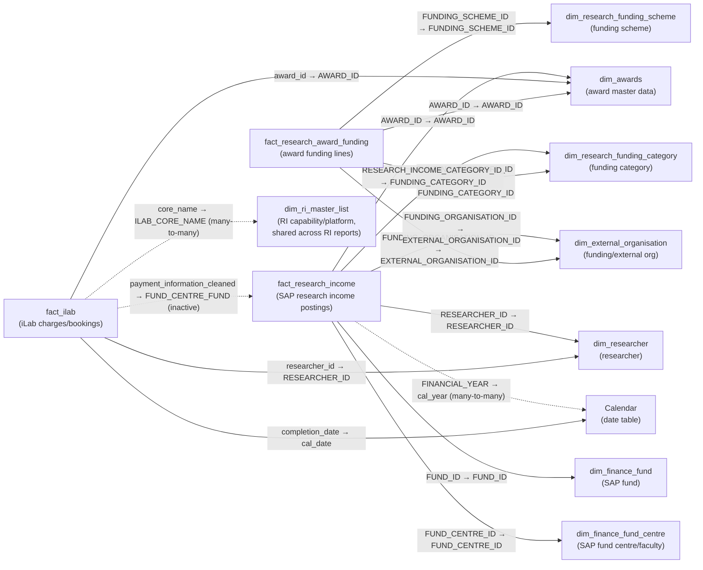

# Awards Data Model

The tables, relationships and source queries behind [[Awards]]. Fifteen tables, sixteen relationships, three facts.

The data dictionary below is transferred in full and is meant to be read as reference. The narrative sections above it explain the shape those tables sit in.

> [!note] Reconciled against [[ri_pbi_awards semantic model]] — last on 2026-09-15
> First reconciled 2026-09-10: all 15 tables, their columns and types, 16 relationships, 11 measures and the 4 calculation items matched the export, with one exception: `fact_ilab` does not carry `_rescued_data` — 53 columns, not 54 — so that row has left the dictionary below. [[Publication]] loads the same `ri_ilab.ilab_charges_award_researcher` table and does carry it, so the two copies differ by that column. Re-checked 2026-09-14 against `ri_pbi_awards` @ `2ea8ea5b`: five dead/dev queries were deleted from `expressions.tmdl` since the last read — `external_organisation`, `Errors in fact_ilab (3)`, `Query1`, `'ri_lakehouse_research_award_funding_equipment (2)'`, and `ripm_research_income` — none of them fed a live table, so no table, relationship, measure or column count changes then. Re-checked again 2026-09-15 against `2ea8ea5b` → `ebf5b16c`: `dim_ri_master_list` widened from 19 to 24 columns — the export now carries the five `_`-prefixed SCD2 metadata columns, same widening as [[Asset]], [[Publication]] and [[iLab Utilisation]] — so the table total in this model is now 15 tables unchanged in count, with `dim_ri_master_list`'s column total the only change; the dictionary below has been updated to match, though the hidden status of the five new columns has not been checked against live TMDL. Go to the export for column types, measure DAX and the Power Query expression inventory. Hidden flags, `toCardinality` and descriptions are not fully in it, and those claims still rest on the 2026-09-01 TMDL read.
>
> Re-checked 2026-09-19 against the 2026-09-19 export (`ri_pbi_awards` @ `bea86c95`). The sub-repo commit moved, but the export was rendered from the same source graph (`944e789f`) as the `11a98af` export this note was last reconciled against, and every file under `graphify/ri_pbi_production/` apart from `_meta.md` is byte-identical. So nothing the export shows has changed. It also means the export cannot show what that commit did change.

## The three facts

| Fact | Grain | Source system |
|---|---|---|
| `fact_research_award_funding` | One row per award-funding line — awarded amounts by scheme and category | PURE / research award data |
| `fact_research_income` | One row per SAP research-income posting — actual, committed and pro-rata income | SAP |
| `fact_ilab` | One row per iLab charge/booking line, carrying award, researcher and core-facility identifiers | iLab |

Eight dimensions, one date table, and three tables that fit no category: `KeyMeasures` (empty container), `Time intelligence` (calculation group), and `Table` — an orphan calculated table with no relationships, covered in [[Awards Gotchas]].

Dimension sharing is partial, which is what makes this a multi-fact schema rather than three separate models:

| Dimension | Reached by |
|---|---|
| `dim_awards` | all three facts |
| `dim_external_organisation` | funding + income |
| `dim_research_funding_category` | funding (`FUNDING_CATEGORY_ID`) + income (`RESEARCH_INCOME_CATEGORY_ID`) |
| `dim_researcher` | income + iLab |
| `dim_research_funding_scheme` | funding only |
| `dim_finance_fund`, `dim_finance_fund_centre` | income only |
| `dim_ri_master_list` | **iLab only** |
| `Calendar` | income (`cal_year`) + iLab (`cal_date`) |

## Relationships

Sixteen, predominantly single-direction fact → dimension.

**Three** relationships are flagged `toCardinality: many`, verified in `relationships.tmdl`:

- `fact_ilab[core_name] → dim_ri_master_list[ILAB_CORE_NAME]`
- `fact_research_income[FINANCIAL_YEAR] → Calendar[cal_year]`
- `fact_ilab[payment_information_cleaned] → fact_research_income[FUND_CENTRE_FUND]`

The source documentation's §2 prose says "two", counting only the first pair; its own §1 table says three. Three is correct — the inactive fact-to-fact relationship is many-to-many as well.

### The inactive relationship

`fact_ilab[payment_information_cleaned] → fact_research_income[FUND_CENTRE_FUND]` is the model's **only inactive relationship and its only bidirectional one**, and it is the only direct link between two facts.

It is off by design. Activating it would let filters propagate between two fact tables in both directions, which is ambiguous at best. Any measure that genuinely needs to cross iLab charges against finance income must turn it on explicitly with `USERELATIONSHIP`.

In practice, nothing does. `research_group_income` — the measure that exists precisely to attribute income to platform users — reconstructs the match by hand with `CONTAINS` instead. See [[Awards Measures]].

### `dim_ri_master_list` reaches one fact only

There is no relationship path, active or inactive, from `dim_ri_master_list` to `fact_research_award_funding` or `fact_research_income`. Their dimensions — `dim_awards`, `dim_research_funding_scheme`, `dim_finance_fund` and the rest — do not connect to it, and a filter cannot flow backwards out of `fact_ilab` through `dim_awards` into another fact.

Two consequences, both recorded rather than fixed:

1. **RLS covers `fact_ilab` and nothing else** — see [[Awards RLS]] and [[RLS Alignment Audit]] §2.1.
2. **Platform attribution has to be computed, not filtered.** That is the whole reason `research_group_income` exists.

Note also that the relationship uses `ILAB_CORE_NAME` while every role filters `ILAB_CAPABILITY_ID` — **two different columns of the same table**. See [[dim_ri_master_list Reference|dim_ri_master_list]].

## Source flow

All source queries live in `expressions.tmdl`. Everything is sourced from Databricks, catalog `pen_research_infrastructure_insights_prd`, across four schemas: `dim_env`, `ri_lakehouse`, `ri_ilab` and `ri_research_dashboard`.

**Connection and helpers.** `Databricks_MACE` holds the connection record; `get_table_from_mace(_a_table_name, _schema_name)` is the two-argument helper every production query calls. As of the 2026-09-14 export, `external_organisation` — a dead query that hand-rolled its own connection instead of using the helper — has been deleted from `expressions.tmdl` (see [[Awards Gotchas]]). A cluster of further helpers in the `functions` query group (`fix_columns`, `TableType`, `lowercase_col_names`, `preprocess_table_text`, `fix_table_column_type`, `preprocess_table_datetime`, `fetch_task`) is called by nothing — inherited boilerplate.

**Parameters.** `StartDate` (`#date(2000,1,1)`) and `EndDate` (`#date(2027,1,1)`) bound the `Calendar` range. A third, `data_path`, is orphaned — see [[Awards Gotchas]].

**Core data flow.** Fifteen queries feed the model. Most are passthroughs; only three transform anything:

1. `dim_env_awards` = `get_table_from_mace("research_award", "dim_env")` — raw award master data.
2. `awards` — passthrough → **`dim_awards`**.
3. `ri_lakehouse_ri_master_list` = `get_table_from_mace("ri_master_list", "ri_lakehouse")` → **`dim_ri_master_list`**.
4. `dim_env_research_funding_category` = `get_table_from_mace("research_funding_category", "dim_env")`.
5. `research_funding_category` — **transforms**: duplicates `FUNDING_CATEGORY_BROAD` into a new `CATEGORY_CODE` column, then four `Table.ReplaceValue` steps abbreviate it (`"Category 1"` → `"CAT 1"` through `"Category 4"` → `"CAT 4"`) → **`dim_research_funding_category`**.
6. `dim_env_research_funding_scheme` = `get_table_from_mace("research_funding_scheme", "dim_env")`.
7. `research_funding_scheme` — passthrough → **`dim_research_funding_scheme`**.
8. `ri_lakehouse_research_award_funding_equipment` = `get_table_from_mace("research_award_funding_equipment", "ri_lakehouse")`.
9. `research_award_funding_equipment` — passthrough → **`fact_research_award_funding`**.
10. `ilab_award_income_researcher` = `get_table_from_mace("ilab_charges_award_researcher", "ri_ilab")` → **`fact_ilab`**.
11. `research_income_fact` = `get_table_from_mace("research_income_fact", "ri_research_dashboard")` → **`fact_research_income`**.
12. `finance_fund_centre` = `get_table_from_mace("ripm_finance_fund_centre", "ri_research_dashboard")` — **transforms**: derives `FACULTY_CODE` from `FUND_CENTRE_LEVEL_2_DESCRPTION` through an `if`/`then`/`else` chain (`"Faculty of Medicine"` → `MNHS`, `"Faculty of Engineering"` → `ENGINEERING`, `"Faculty of Pharmacy & Pharmaceutical Sci"` → `PHARMACY`, `"Faculty of Science"` → `SCIENCE`, `"Faculty of Information Technology"` → `IT`, `"DVC Research & Enterprise"` → `DVCRE`, `"Faculty of Arts"` → `ARTS`, else passthrough) → **`dim_finance_fund_centre`**.
13. `finance_fund` = `get_table_from_mace("ripm_finance_fund", "ri_research_dashboard")` → **`dim_finance_fund`**, sorted by `FUND_ID` in the partition.
14. `ripm_researcher` = `get_table_from_mace("ripm_researcher", "ri_research_dashboard")` → **`dim_researcher`**.
15. **`dim_external_organisation`** sources directly from `get_table_from_mace("dim_external_organisation", "ri_lakehouse")` **in its own partition** — it does not go through the `external_organisation` expression, which is why that expression is orphaned.

`Calendar` is generated in-model via `List.Dates` from `StartDate`/`EndDate`. There are **no static or base64-compressed reference snapshots** in this repo, unlike [[Asset]] or [[iLab Utilisation]].

**Faculty codes are derived twice, differently, across the suite.** This repo's `FACULTY_CODE` maps seven values off SAP fund-centre descriptions; [[Publication]]'s maps four off PURE organisation names, with different spellings (`MNHS` in both, but `SCIENCE`/`ENGINEERING` there too). Don't assume a faculty code means the same thing in two reports.

## Data dictionary

Every table and column in the model, transferred in full.

**Hidden** means not shown in the Fields pane. Every column in this model's fact and dimension tables is visible; the one exception is the `Time intelligence` calculation group's `Ordinal` sort-helper.

### fact_research_award_funding

Fact table: one row per award-funding line (an award's relationship to a funding scheme/category, plus awarded amounts). Feeds the `Platforms`, `total_awarded_amount`, and `Awards (D)` measures.

| Column | Data type | Hidden | Description |
|---|---|---|---|
| AWARD_FUNDING_ID | int64 | **No** | Unique identifier for this award-funding line; the fact table's row-level key. |
| AWARD_ID | int64 | **No** | Identifies the award this funding line belongs to; join key to `dim_awards`. |
| AWARDED_AMOUNT_IN_AUD | double | **No** | Awarded amount converted to Australian dollars — the core "awarded" (as opposed to actual/received) funding figure. |
| AWARDED_AMOUNT_IN_AWARDED_CURRENCY | double | **No** | Awarded amount in the currency the award was originally made in (see `AWARDED_CURRENCY_CODE`). |
| AWARDED_CURRENCY_CODE | string | **No** | ISO currency code the award was originally denominated in. |
| FUNDING_CATEGORY_ID | int64 | **No** | Join key to `dim_research_funding_category[FUNDING_CATEGORY_ID]`. |
| FUNDING_SCHEME_ID | int64 | **No** | Join key to `dim_research_funding_scheme[FUNDING_SCHEME_ID]`. |
| AWARDED_DATE | dateTime | **No** | Date the award/funding line was awarded. |
| EXPECTED_START_DATE | dateTime | **No** | Planned/expected start date of the funded work. |
| EXPECTED_END_DATE | dateTime | **No** | Planned/expected end date of the funded work. |
| ACTUAL_START_DATE | dateTime | **No** | Actual start date of the funded work. |
| ACTUAL_END_DATE | dateTime | **No** | Actual end date of the funded work. |
| RELATED_APPLICATION_ID | int64 | **No** | Identifier of the funding application this line relates to, where applicable. |
| APPLICATION_SUBMISSION_DATE | dateTime | **No** | Date the related funding application was submitted. |
| FUNDING_OPPORTUNITY_ID | int64 | **No** | Identifier of the specific funding opportunity/call the award was made under. |
| MANAGING_ORGANISATION_UNIT_ID | int64 | **No** | Internal organisational unit that manages this award-funding line. |
| FUNDING_ORGANISATION_ID | int64 | **No** | Join key to `dim_external_organisation[EXTERNAL_ORGANISATION_ID]` — the external body providing the funding. |
| FUNDING_PROJECT_SCHEME | string | **No** | Free-text/coded description of the funding project's scheme. |
| FUNDING_FINANCIAL_INDICATOR | string | **No** | Flag/code describing the financial nature of this funding line. Purpose unclear — review with model owner. |
| EDS_ROW_START_DT | dateTime | **No** | Enterprise data warehouse (EDS) row-validity start timestamp (source-system change-tracking column). |
| EDS_ROW_EXPIRATION_DT | dateTime | **No** | EDS row-validity expiration timestamp. |
| EDS_ROW_ACTIVE_FLAG | string | **No** | EDS flag indicating whether this row is the currently active version. |
| EDS_SURROGATE_KEY | int64 | **No** | EDS-generated surrogate key for this source row (not used for report joins). |
| EQUIPMENT_ID | int64 | **No** | Identifier of equipment/platform associated with this award-funding line; source column for the `Platforms` measure's `DISTINCTCOUNT`. |
| UPM_PROJECT_ID | int64 | **No** | Linked project identifier in the University's project-management (UPM) system. |
| OUTPUT_ID | int64 | **No** | Linked research-output identifier, where this funding line is associated with a specific output. |

### fact_research_income

Fact table: one row per SAP research-income posting (actual/committed/pro-rata income against an award, fund, and researcher). Feeds the `actual_amount`, `pro_rata_amount`, `research_income`, `research_group_income`, and `monash_income` measures.

| Column | Data type | Hidden | Description |
|---|---|---|---|
| AWARD_HOLDER_ID | int64 | **No** | Identifier of the award-holder record this income line is attributed to. |
| RESEARCH_INCOME_ID | int64 | **No** | Unique identifier for this income posting; the fact table's row-level key, used to de-duplicate in several measures via `SUMMARIZE`. |
| COMPANY_CODE | string | **No** | SAP company code the posting belongs to. |
| FINANCIAL_YEAR | int64 | **No** | SAP financial year of the posting; many-to-many join key to `Calendar[cal_year]`. |
| RESEARCH_INCOME_CATEGORY_ID | int64 | **No** | Join key to `dim_research_funding_category[FUNDING_CATEGORY_ID]`. |
| AWARD_ID | int64 | **No** | Join key to `dim_awards[AWARD_ID]`. |
| FUNDING_ORGANISATION_ID | int64 | **No** | Join key to `dim_external_organisation[EXTERNAL_ORGANISATION_ID]`. |
| FUND_MANAGEMENT_PERIOD_ID | int64 | **No** | Identifier of the fund-management period this posting falls within. |
| FUND_ID | string | **No** | Join key to `dim_finance_fund[FUND_ID]`. |
| FUND_CENTRE_ID | string | **No** | Join key to `dim_finance_fund_centre[FUND_CENTRE_ID]`. |
| COMMITMENT_ITEM_ID | string | **No** | SAP commitment-item identifier for the posting (budget line classification). |
| ACTUAL_AMOUNT | double | **No** | Actual dollar amount received/posted — summed by the `actual_amount` measure. |
| COMMITMENT_AMOUNT | double | **No** | Committed (not yet actual) dollar amount for this posting. |
| FUND_TO_AWARD_MATCHING_STATUS | string | **No** | Status code describing whether/how this fund posting has been matched back to an award. |
| AWARD_HOLDER_ROLE | string | **No** | Role of the award holder on this posting (e.g. chief investigator, associate investigator). |
| PRIMARY_CHIEF_INVESTIGATOR_INDICATOR | string | **No** | Flag indicating whether the award holder on this posting is the primary chief investigator. |
| PRO_RATA_AMOUNT | double | **No** | This researcher's pro-rata share of the income line — summed by the `pro_rata_amount` measure. |
| RESEARCHER_ID | int64 | **No** | Join key to `dim_researcher[RESEARCHER_ID]`. |
| FUND_CENTRE_FUND | string | **No** | Combined fund-centre/fund identifier; the "to" side of the inactive, bidirectional relationship from `fact_ilab[payment_information_cleaned]`. |

### fact_ilab

Fact table: one row per iLab charge/booking line, carrying the award, researcher, and core-facility identifiers needed to attribute platform usage back to awards and income. Table-level description comment: *"with award, income and researcher"*.

| Column | Data type | Hidden | Description |
|---|---|---|---|
| ack_date | dateTime | **No** | Date the charge/booking was acknowledged. |
| asset_id | int64 | **No** | Identifier of the equipment/asset used, where applicable. |
| award_id | int64 | **No** | Join key to `dim_awards[AWARD_ID]`. |
| billing_date | dateTime | **No** | Date the charge was billed. |
| billing_event_end_date | dateTime | **No** | End date of the billing event/period. |
| billing_status | string | **No** | Status of the billing process for this charge (e.g. billed, pending). |
| category | string | **No** | Category of the iLab charge (e.g. equipment, service). |
| center | string | **No** | iLab core/center name associated with the charge (note US spelling as sourced). |
| charge_id | int64 | **No** | Unique identifier for the charge line. |
| charge_name | string | **No** | Free-text name/description of the charge. |
| completion_date | dateTime | **No** | Date the booked service/job was completed; join key to `Calendar[cal_date]`. |
| completion_year | int64 | **No** | Calendar year derived from `completion_date`; used in the `research_group_income` measure to match against `fact_research_income[FINANCIAL_YEAR]`. |
| core_id | int64 | **No** | Numeric identifier of the iLab core facility. |
| core_name | string | **No** | Name of the iLab core facility; many-to-many join key to `dim_ri_master_list[ILAB_CORE_NAME]`. |
| created_by | string | **No** | User/system that created the charge record. |
| creation_date | dateTime | **No** | Date the charge record was created in iLab. |
| customer_department | string | **No** | Department of the customer who incurred the charge. |
| customer_faculty | string | **No** | Faculty of the customer who incurred the charge. |
| customer_institute | string | **No** | Institute of the customer who incurred the charge. |
| customer_lab | string | **No** | Lab of the customer who incurred the charge. |
| customer_name | string | **No** | Name of the customer who incurred the charge. |
| customer_title | string | **No** | Job title of the customer who incurred the charge. |
| date_file_sent_to_erp | dateTime | **No** | Date the charge file was sent to the ERP/finance system. |
| external_debit_gl_account_credit_gl_account | string | **No** | Combined external debit/credit GL account codes for the charge. |
| file_name | string | **No** | Name of the source file this record was loaded from. |
| file_sort | int64 | **No** | Sort order/sequence for the source file. |
| financial_contact_email | string | **No** | Email of the financial contact for this charge. |
| internal_debit_gl_account_credit_gl_account | string | **No** | Combined internal debit/credit GL account codes for the charge. |
| invoice_num | string | **No** | Invoice number the charge was billed under. |
| job_name | string | **No** | Name of the iLab job/booking this charge relates to. |
| payment_information | string | **No** | Raw payment/fund information string as sourced from iLab. |
| pi_email | string | **No** | Email of the principal investigator associated with the charge. |
| price | double | **No** | Unit price of the charge. |
| price_type | string | **No** | Type of pricing applied (e.g. internal, external). |
| purchase_date | dateTime | **No** | Date of purchase/order for the charge. |
| quantity | double | **No** | Quantity charged. |
| revenue_cost_centre_fund | string | **No** | Revenue-side cost centre/fund string for the charge. |
| reviewed | string | **No** | Flag/status indicating whether the charge has been reviewed. |
| sap_ack_id | int64 | **No** | Identifier of the SAP acknowledgement record for this charge. |
| service_id | string | **No** | Identifier of the service booked/charged. |
| service_rls | string | **No** | Row-level-security-related service code. Purpose unclear — review with model owner. |
| service_type | string | **No** | Type of service booked/charged. |
| status | string | **No** | Overall status of the charge/booking. |
| tax | double | **No** | Tax amount applied to the charge. |
| total_price | double | **No** | Total price including tax and quantity. |
| total_without_tax | double | **No** | Total price excluding tax. |
| unit_of_measure | string | **No** | Unit of measure for the quantity charged. |
| usage_type | string | **No** | Type of usage this charge represents. |
| user_login_email | string | **No** | Login email of the user who incurred the charge. |
| staff_id | string | **No** | Staff identifier associated with the charge, where the user is Monash staff. |
| researcher_id | int64 | **No** | Join key to `dim_researcher[RESEARCHER_ID]`. |
| fund_fund_centre_id | string | **No** | Combined fund/fund-centre identifier derived for this charge. |
| payment_information_cleaned | string | **No** | Cleaned version of `payment_information`; the "from" side of the inactive, bidirectional relationship to `fact_research_income[FUND_CENTRE_FUND]`. |

### dim_awards

One row per award (research grant/agreement), with descriptive attributes, holder/investigator counts, and SCD2-style audit columns.

| Column | Data type | Hidden | Description |
|---|---|---|---|
| AWARD_ID | int64 | **No** | Unique award identifier; join key to both `fact_research_award_funding` and `fact_research_income`, and to `fact_ilab[award_id]`. |
| AWARD_UUID | string | **No** | Globally-unique identifier for the award in the source system. |
| AWARD_TITLE | string | **No** | Title of the award/project. |
| AWARD_TYPE | string | **No** | Descriptive award type (e.g. grant, contract). |
| AWARD_TYPE_CODE | string | **No** | Coded version of `AWARD_TYPE`. |
| AWARD_SUBTYPE | string | **No** | Descriptive award subtype. |
| AWARD_SUBTYPE_CODE | string | **No** | Coded version of `AWARD_SUBTYPE`. |
| AWARD_SUBTYPE_ID | int64 | **No** | Numeric identifier of the award subtype. |
| AWARD_STATUS | string | **No** | Current status of the award (e.g. active, closed). |
| WORKFLOW_STATUS_CODE | string | **No** | Workflow/approval status code for the award record. |
| FUNDING_ORGANISATION_LIST | string | **No** | Concatenated list of funding organisations associated with the award. |
| FUNDING_CATEGORY_BROAD_LIST | string | **No** | Concatenated list of broad funding categories associated with the award. |
| TRANSFER_IN_INDICATOR | string | **No** | Flag indicating the award was transferred in from another institution. |
| TRANSFER_OUT_INDICATOR | string | **No** | Flag indicating the award was transferred out to another institution. |
| FUNDER_REFERENCE_NUMBER | string | **No** | Funder-assigned reference number for the award. |
| LEGACY_REFERENCE_NUMBER | string | **No** | Reference number carried over from a legacy system. |
| RECORDS_MANAGEMENT_NUMBER | string | **No** | Records-management system reference number for the award. |
| LEAD_COLLABORATOR_INDICATOR | string | **No** | Flag indicating Monash is the lead collaborator on the award. |
| AWARD_HOLDER_LIST | string | **No** | Concatenated list of all award holders. |
| PRIMARY_CHIEF_INVESTIGATOR_FULL_NAME_LIST | string | **No** | Full name(s) of the primary chief investigator(s). |
| AWARD_HOLDER_LIST_INTERNAL | string | **No** | Concatenated list of internal (Monash) award holders. |
| ORGANISATION_LIST_INTERNAL | string | **No** | Concatenated list of internal organisations involved in the award. |
| ORGANISATION_LIST_EXTERNAL | string | **No** | Concatenated list of external organisations involved in the award. |
| AWARD_HOLDER_COUNT | int64 | **No** | Total number of award holders. |
| AWARD_HOLDER_COUNT_INTERNAL | int64 | **No** | Number of internal (Monash) award holders. |
| AWARD_HOLDER_COUNT_EXTERNAL | int64 | **No** | Number of external award holders. |
| AWARD_HOLDER_COUNT_CI | int64 | **No** | Number of chief-investigator award holders. |
| AWARD_HOLDER_COUNT_AI | int64 | **No** | Number of associate-investigator award holders. |
| AWARD_HOLDER_COUNT_INTERNAL_CI | int64 | **No** | Number of internal chief-investigator award holders. |
| AWARD_HOLDER_COUNT_INTERNAL_PCI | int64 | **No** | Number of internal primary-chief-investigator award holders. |
| CONFIDENTIAL_INDICATOR | string | **No** | Flag indicating the award is marked confidential. |
| CREATED_DATE | dateTime | **No** | Date the award record was created in the source system. |
| MODIFIED_DATE | dateTime | **No** | Date the award record was last modified. |
| LEAD_ORGANISATION | string | **No** | Name of the lead organisation on the award. |
| LEAD_ORGANISATION_ID | int64 | **No** | Identifier of the lead organisation. |
| LEAD_ORGANISATION_UUID | string | **No** | Globally-unique identifier of the lead organisation. |
| EDS_ROW_START_DT | dateTime | **No** | EDS row-validity start timestamp. |
| EDS_ROW_EXPIRATION_DT | dateTime | **No** | EDS row-validity expiration timestamp. |
| EDS_ROW_ACTIVE_FLAG | string | **No** | EDS flag indicating whether this row is the currently active version. |
| EDS_SURROGATE_KEY | int64 | **No** | EDS-generated surrogate key for this source row. |

### dim_external_organisation

One row per external organisation (funders, collaborators) referenced by either fact table's `FUNDING_ORGANISATION_ID`.

| Column | Data type | Hidden | Description |
|---|---|---|---|
| _START_TIMESTAMP | dateTime | **No** | Source-system SCD2 validity start timestamp. |
| _EXPIRATION_TIMESTAMP | dateTime | **No** | Source-system SCD2 validity expiration timestamp. |
| _ROW_ACTIVE_FLAG | string | **No** | Flag indicating whether this row is the currently active version. |
| _SURROGATE_KEY | int64 | **No** | Source-generated surrogate key for this row. |
| EXTERNAL_ORGANISATION_ID | string | **No** | Unique identifier for the external organisation; join key to both fact tables' `FUNDING_ORGANISATION_ID`. |
| EXTERNAL_ORGANISATION_UUID | string | **No** | Globally-unique identifier for the organisation. |
| EXTERNAL_ORGANISATION_CODE | string | **No** | Short code for the organisation. |
| EXTERNAL_ORGANISATION | string | **No** | Display name of the organisation. |
| EXTERNAL_ORGANISATION_CONTACT_ADDRESS_1 | string | **No** | First line of the organisation's contact address. |
| EXTERNAL_ORGANISATION_CONTACT_ADDRESS_2 | string | **No** | Second line of the organisation's contact address. |
| EXTERNAL_ORGANISATION_CITY | string | **No** | City of the organisation's address. |
| EXTERNAL_ORGANISATION_STATE | string | **No** | State/province of the organisation's address. |
| EXTERNAL_ORGANISATION_COUNTRY | string | **No** | Country of the organisation's address. |
| EXTERNAL_ORGANISATION_COUNTRY_CODE | string | **No** | ISO country code of the organisation's address. |
| EXTERNAL_ORGANISATION_PHONE | string | **No** | Contact phone number for the organisation. |
| EXTERNAL_ORGANISATION_TYPE | string | **No** | Type/classification of the organisation (e.g. government, industry). |
| EXTERNAL_ORGANISATION_ACRONYM | string | **No** | Acronym/short name for the organisation. |
| EXTERNAL_ORGANISATION_STATUS | string | **No** | Current status of the organisation record (e.g. active). |
| EXTERNAL_ORGANISATION_PRIMARY_ANZSIC2006_CODE | string | **No** | Primary ANZSIC 2006 industry classification code for the organisation. |
| EXTERNAL_ORGANISATION_PARENT_ID | string | **No** | Identifier of the organisation's parent organisation, if any. |
| EXTERNAL_ORGANISATION_PARENT_UUID | string | **No** | Globally-unique identifier of the parent organisation. |
| EXTERNAL_ORGANISATION_PARENT_CODE | string | **No** | Short code of the parent organisation. |
| EXTERNAL_ORGANISATION_PARENT | string | **No** | Display name of the parent organisation. |
| EXTERNAL_ORGANISATION_MODIFIED_DATE | dateTime | **No** | Date the organisation record was last modified. |
| EXTERNAL_ORGANISATION_DUNS_NUMBER | string | **No** | Dun & Bradstreet (DUNS) business identifier for the organisation. |

### dim_finance_fund

One row per SAP fund, with type/application classification and validity dates.

| Column | Data type | Hidden | Description |
|---|---|---|---|
| FUND_ID | string | **No** | Unique fund identifier; join key to `fact_research_income[FUND_ID]`. |
| FUND_CODE | string | **No** | Short code for the fund. |
| FUND | string | **No** | Display name of the fund. |
| FUND_DESCRIPTION | string | **No** | Longer descriptive text for the fund. |
| FINANCIAL_MANAGEMENT_AREA_CODE | string | **No** | Financial management area the fund belongs to. |
| FUND_VALID_FROM_DATE | dateTime | **No** | Date the fund became valid/active. |
| FUND_VALID_TO_DATE | dateTime | **No** | Date the fund's validity ends. |
| CUSTOMER_ACCOUNT_NUMBER | string | **No** | Customer account number associated with the fund, where applicable. |
| FUND_TYPE_CODE | string | **No** | Coded fund type. |
| FUND_TYPE_DESCRIPTION | string | **No** | Descriptive fund type. |
| FUND_APPLICATION_CODE | string | **No** | Coded fund application. |
| FUND_APPLICATION | string | **No** | Fund application short label. |
| FUND_APPLICATION_DESCRIPTION | string | **No** | Descriptive fund application text. |
| FUND_CODE_DESCRIPTION | string | **No** | Combined code-plus-description label for the fund code. |
| FUND_APPLICATION_CODE_DESCRIPTION | string | **No** | Combined code-plus-description label for the fund application. |
| FUND_TYPE_CODE_DESCRIPTION | string | **No** | Combined code-plus-description label for the fund type. |

### dim_finance_fund_centre

One row per SAP fund centre, carrying the full 7-level fund-centre hierarchy plus a derived faculty grouping.

| Column | Data type | Hidden | Description |
|---|---|---|---|
| FUND_CENTRE_CODE | string | **No** | Short code for the fund centre. |
| FINANCIAL_MANAGEMENT_AREA_CODE | string | **No** | Financial management area the fund centre belongs to. |
| FUND_CENTRE_BUSINESS_AREA_CODE | string | **No** | Business area code for the fund centre. |
| FUND_CENTRE_VALID_FROM_DATE | dateTime | **No** | Date the fund centre became valid/active. |
| FUND_CENTRE_VALID_TO_DATE | dateTime | **No** | Date the fund centre's validity ends. |
| FUND_CENTRE_LEVEL_1 | string | **No** | Level-1 (top) node of the fund-centre hierarchy. |
| FUND_CENTRE_LEVEL_1_CODE | string | **No** | Coded version of level 1. |
| FUND_CENTRE_LEVEL_1_DESCRPTION | string | **No** | Descriptive text for level 1 (source spelling "DESCRPTION" preserved). |
| FUND_CENTRE_LEVEL_2 | string | **No** | Level-2 node of the fund-centre hierarchy (typically faculty). |
| FUND_CENTRE_LEVEL_2_CODE | string | **No** | Coded version of level 2. |
| FUND_CENTRE_LEVEL_2_DESCRPTION | string | **No** | Descriptive text for level 2; source column for the derived `FACULTY_CODE`. |
| FUND_CENTRE_LEVEL_3 | string | **No** | Level-3 node of the fund-centre hierarchy. |
| FUND_CENTRE_LEVEL_3_CODE | string | **No** | Coded version of level 3. |
| FUND_CENTRE_LEVEL_3_DESCRPTION | string | **No** | Descriptive text for level 3. |
| FUND_CENTRE_LEVEL_4 | string | **No** | Level-4 node of the fund-centre hierarchy. |
| FUND_CENTRE_LEVEL_CODE | string | **No** | Generic level code field. Purpose unclear — review with model owner. |
| FUND_CENTRE_LEVEL_4_DESCRPTION | string | **No** | Descriptive text for level 4. |
| FUND_CENTRE_LEVEL_5 | string | **No** | Level-5 node of the fund-centre hierarchy. |
| FUND_CENTRE_LEVEL_5_CODE | string | **No** | Coded version of level 5. |
| FUND_CENTRE_LEVEL_5_DESCRPTION | string | **No** | Descriptive text for level 5. |
| FUND_CENTRE_LEVEL_6_CODE | string | **No** | Coded version of level 6. |
| FUND_CENTRE_LEVEL_7 | string | **No** | Level-7 (bottom) node of the fund-centre hierarchy. |
| FUND_CENTRE_LEVEL_7_CODE | string | **No** | Coded version of level 7. |
| FUND_CENTRE_CODE_DESCRIPTION | string | **No** | Combined code-plus-description label for `FUND_CENTRE_CODE`. |
| FUND_CENTRE_ID | string | **No** | Unique fund-centre identifier; join key to `fact_research_income[FUND_CENTRE_ID]`. |
| FUND_CENTRE | string | **No** | Display name of the fund centre. |
| FUND_CENTRE_DESCRIPTION | string | **No** | Longer descriptive text for the fund centre. |
| FUND_CENTRE_LEVEL_6 | string | **No** | Level-6 node of the fund-centre hierarchy. |
| FUND_CENTRE_LEVEL_6_DESCRIPTION | string | **No** | Descriptive text for level 6 (note: correctly spelled, unlike levels 1–5/7). |
| COMPANY_CODE | string | **No** | SAP company code the fund centre belongs to. |
| FUND_CENTRE_LEVEL_7_DESCRIPTION | string | **No** | Descriptive text for level 7 (correctly spelled). |
| FACULTY_CODE | string | **No** | Faculty grouping derived in M from `FUND_CENTRE_LEVEL_2_DESCRPTION` (see [[#Source flow]], `finance_fund_centre` query) — e.g. `"MNHS"`, `"ENGINEERING"`, `"SCIENCE"`, `"IT"`, `"DVCRE"`, `"ARTS"`, `"PHARMACY"`, or the raw level-2 description if no mapping matched. |

### dim_research_funding_category

One row per research funding category (e.g. HERDC-style categories), with a broad grouping and an abbreviated code.

| Column | Data type | Hidden | Description |
|---|---|---|---|
| FUNDING_CATEGORY_ID | int64 | **No** | Unique funding-category identifier; join key to `fact_research_award_funding[FUNDING_CATEGORY_ID]` and `fact_research_income[RESEARCH_INCOME_CATEGORY_ID]`. |
| FUNDING_CATEGORY_CODE | string | **No** | Coded funding category. |
| FUNDING_CATEGORY | string | **No** | Descriptive funding category name. |
| FUNDING_CATEGORY_BROAD | string | **No** | Broader grouping the category rolls up to (e.g. "Category 1"–"Category 4"). |
| FUNDING_CATEGORY_BROAD_DESCRIPTION | string | **No** | Descriptive text for the broad grouping. |
| FUNDING_CATEGORY_HERDC_INDICATOR | string | **No** | Flag indicating whether the category counts toward HERDC (Higher Education Research Data Collection) reporting. |
| EDS_ROW_START_DT | dateTime | **No** | EDS row-validity start timestamp. |
| EDS_ROW_EXPIRATION_DT | dateTime | **No** | EDS row-validity expiration timestamp. |
| EDS_ROW_ACTIVE_FLAG | string | **No** | EDS flag indicating whether this row is the currently active version. |
| EDS_SURROGATE_KEY | int64 | **No** | EDS-generated surrogate key for this source row. |
| CATEGORY_CODE | string | **No** | Abbreviated form of `FUNDING_CATEGORY_BROAD`, derived in M (`"CAT 1"`–`"CAT 4"`; see [[#Source flow]]). |

### dim_research_funding_scheme

One row per research funding scheme, with a "broadest" rollup grouping.

| Column | Data type | Hidden | Description |
|---|---|---|---|
| FUNDING_SCHEME_ID | int64 | **No** | Unique funding-scheme identifier; join key to `fact_research_award_funding[FUNDING_SCHEME_ID]`. |
| FUNDING_SCHEME_BROADEST | string | **No** | Broadest-level rollup grouping for the scheme. |
| FUNDING_SCHEME_BROADEST_CODE | string | **No** | Coded version of `FUNDING_SCHEME_BROADEST`. |
| FUNDING_SCHEME_BROAD | string | **No** | Broad (intermediate) grouping for the scheme. |

### dim_researcher

One row per researcher, with names and identifying attributes.

| Column | Data type | Hidden | Description |
|---|---|---|---|
| RESEARCHER_ID | int64 | **No** | Unique researcher identifier; join key to `fact_research_income[RESEARCHER_ID]` and `fact_ilab[researcher_id]`. |
| RESEARCHER_UUID | string | **No** | Globally-unique identifier for the researcher. |
| RESEARCHER_ORCID | string | **No** | Researcher's ORCID identifier, where recorded. |
| STAFF_ID | string | **No** | Monash staff identifier, where the researcher is Monash staff. |
| FIRST_NAME | string | **No** | Researcher's first name. |
| LAST_NAME | string | **No** | Researcher's last name. |
| FULL_NAME | string | **No** | Researcher's full name. |
| GENDER | string | **No** | Researcher's recorded gender. |
| EDS_ROW_START_DT | dateTime | **No** | EDS row-validity start timestamp. |
| EDS_ROW_EXPIRATION_DT | dateTime | **No** | EDS row-validity expiration timestamp. |
| EDS_ROW_ACTIVE_FLAG | string | **No** | EDS flag indicating whether this row is the currently active version. |
| EDS_SURROGATE_KEY | int64 | **No** | EDS-generated surrogate key for this source row. |

### dim_ri_master_list

Shared cross-system reference table listing all RI capabilities (facilities/platforms), reused with different join keys across the RI reporting suite (iLab, PURE, Survey, Finance, Asset, Risk). In this repo, **all 19 non-SCD2 columns are visible** — unlike `ri_pbi_asset`, which hides all but five of them — as at the 2026-09-01 TMDL read; the five SCD2 columns added to the export on 2026-09-15 have not yet been checked.

| Column | Data type | Hidden | Description |
|---|---|---|---|
| INDEX | int64 | **No** | Row sequence number from the source table; not used for reporting or joins. |
| CAPABILITY_CODE | string | **No** | Unique code identifying a capability (facility/platform). |
| CAPABILITY_NAME | string | **No** | Display name of the capability. |
| NODE_ID | string | **No** | Organisational node identifier — cross-system join key used by other repos' fact tables (not used for a relationship in this model). |
| NODE_NAME | string | **No** | Display name of the organisational node. |
| COST_CENTRE_NAME | string | **No** | Name of the cost centre associated with the capability. |
| COST_CENTRE | string | **No** | SAP cost centre code — the join key `ri_pbi_asset` uses against its fact table; not used for a relationship in this model. |
| FUND_ID | string | **No** | Fund identifier — note this is a *different* `FUND_ID` concept from `dim_finance_fund[FUND_ID]`; not used for a relationship in this model. |
| CAPABILITY_ISO | string | **No** | ISO accreditation status/code for the capability. |
| CAPABILITY_TYPE | string | **No** | Classification of the capability (e.g. platform, facility, service). |
| CAPABILITY_GOVERNANCE | string | **No** | Governance model/committee the capability reports into. |
| SURVEY_CAPABILITY_ID | string | **No** | Join key used by `ri_pbi_survey`; not used for a relationship in this model. |
| PURE_ORGANISATION_ID | string | **No** | Join key used for PURE research-organisation records; not used for a relationship in this model. |
| PURE_FACILITY_NAME | string | **No** | Facility name in PURE, used for `ri_pbi_publication` joins; not used for a relationship in this model. |
| PURE_FACILITY_ID | int64 | **No** | Numeric facility ID, join key to PURE publication records; not used for a relationship in this model. |
| ILAB_CAPABILITY_ID | string | **No** | The column every RLS role in this repo filters (`== "<CODE>"`); it is **not** the column the model relationship uses (see `ILAB_CORE_NAME` below and [[Awards RLS]]). |
| ILAB_CORE_NAME | string | **No** | The actual relationship join key **this repo uses**: many-to-many join to `fact_ilab[core_name]`. |
| RLS_FACILITY_GROUP | string | **No** | RLS group for facility-level access restriction; not referenced by any role's `tablePermission` in this repo (roles filter `ILAB_CAPABILITY_ID` directly instead). |
| RLS_FACULTY_GROUP | string | **No** | RLS group for faculty-level access restriction; not referenced by any role's `tablePermission` in this repo. |
| _BUSINESS_KEY | string | *(unverified)* | SCD2 business key — added to the export on 2026-09-15; hidden status not yet checked against live TMDL. |
| _EXPIRATION_TIMESTAMP | dateTime | *(unverified)* | SCD2 row-expiration timestamp — see [[Projects/Databricks/Tables/ri_master_list SCD2 Reference|ri_master_list SCD2 Reference]]. |
| _ROW_ACTIVE_FLAG | string | *(unverified)* | SCD2 active-row flag; always `Y` here since `ri_lakehouse.ri_master_list` exposes only active rows. |
| _START_TIMESTAMP | dateTime | *(unverified)* | SCD2 row-start timestamp. |
| _SURROGATE_KEY | int64 | *(unverified)* | SCD2 surrogate key. |

### Calendar

Standard date table, one row per calendar day across the `StartDate`–`EndDate` range (currently 2000-01-01 to 2027-01-01).

| Column | Data type | Hidden | Description |
|---|---|---|---|
| cal_date | dateTime | **No** | The calendar date for this row; join key to `fact_ilab[completion_date]`. |
| cal_year | int64 | **No** | Calendar year of `cal_date`; many-to-many join key to `fact_research_income[FINANCIAL_YEAR]`. |
| cal_month | int64 | **No** | Calendar month number (1–12). |
| cal_month_name | string | **No** | Full month name (e.g. "January"). |
| MonthYear | string | **No** | Short month-and-year label (e.g. "Jan-2024") for chart axes. |
| cal_mon_yeat_int | int64 | **No** | Combined YYYYMM number for strict chronological sort/join (note source typo "yeat" for "year"). |
| Day | string | **No** | Day-of-week name (e.g. "Monday"). |
| Date | int64 | **No** | Day-of-month number. |
| Day of Week | int64 | **No** | Numeric day-of-week (per `Date.DayOfWeek`). |
| day_type | string | **No** | `"weekday"` or `"weekend"`, derived from `Day of Week`. |
| fiscal_year | int64 | **No** | Australian financial year (July–June). |
| fy_label | string | **No** | Financial year label, "FY YY/YY" format. |

### KeyMeasures

Container table for all report-wide DAX measures. Holds no data of its own — see [[Awards Measures]] for its contents.

### Time intelligence (calculation group)

Not a fact/dimension table but a DAX **calculation group** supplying date-comparison logic that substitutes for the model's disabled automatic time intelligence (`__PBI_TimeIntelligenceEnabled = 0`). Its calculation items are documented in [[Awards Measures]].

| Column | Data type | Hidden | Description |
|---|---|---|---|
| Name | string | **No** | Display name of the calculation item (`Current`, `YTD`, `PY YTD`, `YTD (%)`); sorted by `Ordinal`. |
| Ordinal | int64 | Yes *(sort-helper)* | Numeric sort order controlling the display sequence of the `Name` column's calculation items. |

### Table (orphan calculated table)

A calculated table with no relationships to the rest of the model and no annotation explaining its purpose — see [[Awards Gotchas]].

| Column | Data type | Hidden | Description |
|---|---|---|---|
| RESEARCH_INCOME_ID | (inferred) | **No** | Inferred/duplicated from `fact_research_income[RESEARCH_INCOME_ID]` via the table's `CALCULATETABLE(SUMMARIZE(...))` source expression. |
| ACTUAL_AMOUNT | (inferred) | **No** | Inferred/duplicated from `fact_research_income[ACTUAL_AMOUNT]` via the same source expression. |

## See also

- [[Awards]] — the repo entry note
- [[Awards Measures]] — the measure inventory built on these tables
- [[Awards RLS]] — how row-level security travels through the master-list join
- [[Awards Gotchas]] — the orphan calculated table, dead code and naming defects
- [[dim_ri_master_list Reference|dim_ri_master_list]] — the shared identity table, joined here on `ILAB_CORE_NAME`
- [[Shared Conventions]] — the PBIP layout and Databricks source pattern
- [[ri_pbi_awards semantic model]] — the exported model (derived, never hand-edited): every column and type, measure DAX, relationships and Power Query expressions
- **Derived layer** (`graphify/`, never hand-edited): [[_COMMUNITY_Research Awards Model]], [[_COMMUNITY_Research Awards Funding]], [[fact_research_award_funding]], [[fact_research_income]], [[fact_ilab_1]], [[dim_awards]], [[dim_researcher]], [[dim_finance_fund]], [[dim_finance_fund_centre]], [[dim_research_funding_scheme]], [[dim_research_funding_category]], [[dim_external_organisation]], [[ilab_award_income_researcher]], [[Databricks_MACE_1]], [[get_table_from_mace_1]]
- **Derived layer — M queries** (`graphify/`, never hand-edited): [[awards]], [[finance_fund]], [[finance_fund_centre]], [[research_award_funding_equipment]], [[ri_lakehouse_research_award_funding_equipment]], [[research_funding_category]], [[research_funding_scheme]], [[research_income_fact]], [[ripm_researcher]], [[ri_lakehouse_ri_master_list_2]], [[dim_env_awards]], [[dim_env_research_funding_category]], [[dim_env_research_funding_scheme]], [[fetch_task]], [[fix_columns]], [[fix_table_column_type]], [[lowercase_col_names]], [[preprocess_table_datetime]], [[preprocess_table_text]], [[TableType]], [[data_path]], [[StartDate]], [[EndDate]], [[Calendar]]
