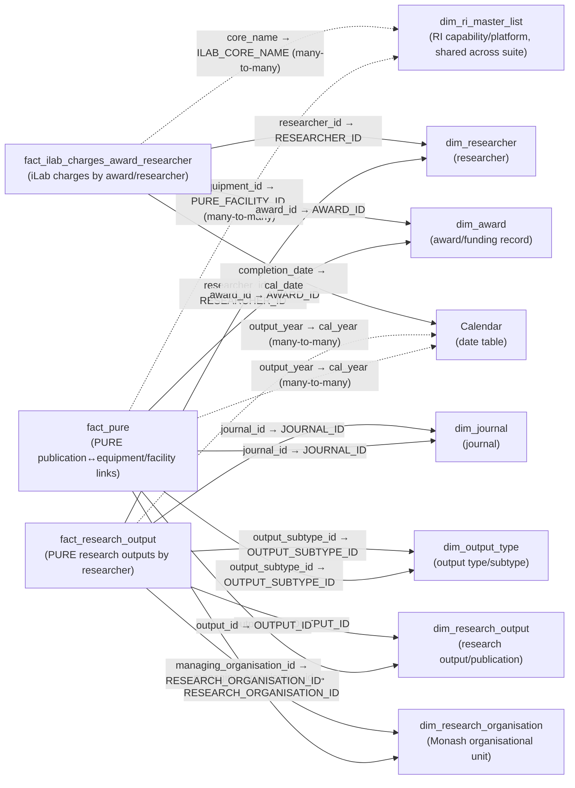

# Publication Data Model

The tables, relationships and source queries behind [[Publication]]. Fourteen tables, seventeen relationships, three facts.

The data dictionary below is transferred in full and is meant to be read as reference rather than prose — every column of every table, with its type and purpose. The narrative sections above it explain the shape those tables sit in.

> [!note] Reconciled against [[ri_pbi_publication semantic model]] — last on 2026-09-15
> First reconciled 2026-09-10: all 14 tables, their columns and types, 17 relationships, 21 measures and the 4 calculation items matched the export. Re-checked 2026-09-15: `dim_ri_master_list` widened from 19 to 24 columns — the export now carries the five `_`-prefixed SCD2 metadata columns, the same widening seen in [[Asset]], [[Awards]] and [[iLab Utilisation]] — with no change to table, relationship or measure counts. Go there for measure DAX and the Power Query expression inventory. Hidden flags, `toCardinality` and descriptions are not fully in it, and those claims — including the hidden status of the five new columns — still rest on the 2026-09-01 TMDL read.
>
> Re-checked 2026-09-19 against the 2026-09-19 export (`ri_pbi_publication` @ `63ae148a`). The sub-repo commit moved, but the export was rendered from the same source graph (`944e789f`) as the `11a98af` export this note was last reconciled against, and every file under `graphify/ri_pbi_production/` apart from `_meta.md` is byte-identical. So nothing the export shows has changed. It also means the export cannot show what that commit did change.

> [!warning] `fact_research_output` and `fact_pure` refresh nightly from month-old data
> Both trace back to `ri_ilab.research_output`, last written **2026-08-04**: step 3 below reads it directly, and step 4's `fact_pure_publication` is rebuilt nightly in `ri_lakehouse` from that same table. The producer is the cause — `run_research_output()` is commented out in the `ri_ilab` repo's `main.py`, but the nightly consumer job kept running, which froze the data rather than stopping it. A successful refresh is therefore not evidence the numbers are current. Verified live against Databricks on 2026-09-06; see [[Projects/Databricks/Reference/Databricks Migration State|Databricks Migration State]].

## The three facts

| Fact | Grain | Source system |
|---|---|---|
| `fact_pure` | One row per PURE publication ↔ equipment/facility/award link | PURE |
| `fact_research_output` | One row per PURE research output attributed to a researcher | PURE |
| `fact_ilab_charges_award_researcher` | One row per iLab facility charge/booking line, attributed to an award and researcher | iLab |

`fact_research_output` is fetched from the `ri_ilab` Databricks schema under the table name `research_output`, which makes it look like iLab data in every listing. It isn't — it is PURE research-output data, joined to `dim_researcher`, `dim_journal` and the other PURE dimensions, with no connection to iLab facility usage.

The seven shared dimensions are `dim_award`, `dim_journal`, `dim_output_type`, `dim_research_organisation`, `dim_research_output`, `dim_researcher` and `dim_ri_master_list` — though "shared" overstates it, since no dimension reaches all three facts. `Calendar` is the date table, `journal_list` a local reference table with no relationships at all, and `key_measures` / `Time intelligence` are empty containers.

## Relationships

All 17 relationships run single-direction from dimension to fact. None are inactive, and the model defines no bidirectional cross-filtering anywhere. Four are flagged many-to-many (`toCardinality: many`).

### The two master-list keys

Publication is the only repo in the suite that joins [[dim_ri_master_list Reference|dim_ri_master_list]] on **two different keys inside one model**:

- `fact_ilab_charges_award_researcher[core_name] → dim_ri_master_list[ILAB_CORE_NAME]` — the iLab path
- `fact_pure[equipment_id] → dim_ri_master_list[PURE_FACILITY_ID]` — the PURE path

Both are many-to-many. The `fact_pure` column is named `equipment_id` but functions as the PURE facility key; that is how `relationships.tmdl` wires it, not a documentation slip. Because the two facts reach the master list by different columns, there is no single RI-platform filter path across them — a filter applied through one does not reach the other.

### The missing third join

**`fact_research_output` has no relationship to `dim_ri_master_list` at all.** PURE-sourced research outputs cannot be filtered by RI platform or capability through the model's relationships, in either direction. Its only route toward iLab data is the shared `dim_researcher` dimension, and filters do not propagate up from a fact through a one-side dimension into another fact.

Two consequences worth internalising before writing DAX here:

1. The `researcher_publication` measure substitutes a manual `CONTAINS` match on researcher and year for the missing relationship — see [[Publication Measures]].
2. Every role in [[Publication RLS]] filters `dim_ri_master_list`, so **no role restricts `fact_research_output`**. That is the unsecured-fact finding in [[RLS Alignment Audit]], and it follows directly from this gap rather than from anything in the role files.

### Date grain

`Calendar` connects to the model three times, at two different grains. `fact_ilab_charges_award_researcher[completion_date] → Calendar[cal_date]` is a normal day-grain many-to-one. Both `fact_pure[output_year]` and `fact_research_output[output_year]` join `Calendar[cal_year]` at year grain, many-to-many.

Only the iLab fact has a `cal_date`-grain relationship. Anything built on `DATEADD`, `DATESYTD` or the `Time intelligence` calculation group is therefore reaching PURE data only indirectly, through `output_year → cal_year` — see [[Publication Measures]].

## Source flow

All source queries live in `expressions.tmdl`.

**Connection and helpers.** `Databricks_MACE` holds the connection record (`adb_https`, `adb_sql`, `adb_catalog = "pen_research_infrastructure_insights_prd"`). Every live fetch query calls the two-argument helper `get_table_from_mace(_a_table_name, _schema_name)`, which opens `Databricks.Catalogs(...)` scoped to the given schema and returns the named table's `Data`. An older single-argument version sits commented out immediately above the live definition — read past it before assuming an arity, per [[Shared Conventions]]. A further cluster of helpers under `queryGroup: functions` is dead code; see [[Publication Gotchas]].

**Parameters.** `StartDate` = `#date(2000, 1, 1)` and `EndDate` = `#date(2027, 1, 1)`, bounding the `Calendar` table's range.

**Core data flow.** Eleven queries feed the model:

1. `ri_lakehouse_ri_master_list` = `get_table_from_mace("ri_master_list", "ri_lakehouse")` → `dim_ri_master_list`.
2. `ilab_charges_award_researcher` = `get_table_from_mace("ilab_charges_award_researcher", "ri_ilab")` → `fact_ilab_charges_award_researcher`, untransformed.
3. `research_output` = `get_table_from_mace("research_output", "ri_ilab")` → `fact_research_output`, untransformed.
4. `pure_publication` = `get_table_from_mace("fact_pure_publication", "ri_lakehouse")` → `fact_pure`, untransformed.
5. `rapm_research_award` = `get_table_from_mace("rapm_research_award", "ri_research_dashboard")` → `dim_award`.
6. `ropm_researchers` = `get_table_from_mace("ropm_researcher", "ri_research_dashboard")` → `dim_researcher`.
7. `ropm_research_journal` = `get_table_from_mace("ropm_research_journal", "ri_research_dashboard")`, then a left-outer `Table.NestedJoin` against the local `journal_list` query on `{JOURNAL_ISSN_LIST, JOURNAL_TITLE}`, expanding `nature_science` and replacing empty strings with `null` → `dim_journal`. This merge is the only thing that pulls the Nature/Science family classification into the model.
8. `ropm_research_output_type` = `get_table_from_mace("ropm_research_output_type", "ri_research_dashboard")`, sorted by `OUTPUT_TYPE_CODE`/`OUTPUT_SUBTYPE_CODE` → `dim_output_type`.
9. `ropm_research_output` = `get_table_from_mace("ropm_research_output", "ri_research_dashboard")`, filtered to drop null/blank `OUTPUT_ID`, dropping the `EDS_ROW_EXPIRATION_DATE` column → `dim_research_output`.
10. `research_organisation` = `get_table_from_mace("dim_research_organisation", "ri_lakehouse")`, plus an added `FACULTY_CODE` conditional column mapping four `PRIMARY_ORGANISATION_UNIT` values ("Faculty of Med Nursing & Health Sci" → `MNHS`, "Faculty of Science" → `SCIENCE`, "Faculty of Pharmacy & Pharm Science" → `PHARMACY`, "Faculty of Engineering" → `ENGINEERING`) and passing every other value through unchanged → `dim_research_organisation`. Only four faculties get a short code; everything else falls back to the raw organisational-unit name.
11. `journal_list` loads the local CSV — see the path gotcha in [[Publication Gotchas]] — feeding the `journal_list` table, and is consumed only by the step 7 merge. It has no model relationship to anything.

`Calendar` is generated in-model from `StartDate`/`EndDate` via `List.Dates`, with no Databricks source. `key_measures`'s partition is Power BI Desktop's standard empty-measures-table pattern: a tiny base64/Deflate-compressed placeholder whose only column is immediately removed. No other frozen static snapshots exist in this model, and nothing carries a `queryGroup: decomissioned` annotation.

## Data dictionary

Every table and column in the model, transferred in full.

**Hidden** means not shown in the Fields pane — still queryable by measures and relationships. Almost nothing in this model is hidden: no table has `isHidden` set, and the only hidden column anywhere in the entire semantic model is `Time intelligence[Ordinal]`, a sort helper. That is a marked departure from [[Asset]]'s pattern of hiding join-key and audit columns, and is discussed in [[Publication Gotchas]].

### fact_pure

Fact table: one row per PURE publication↔equipment/facility/award link. Table is not hidden.

| Column | Data type | Hidden | Description |
|---|---|---|---|
| award_id | int64 | **No** | Award identifier the publication is attributed to; join key to `dim_award[AWARD_ID]`. |
| equipment_id | int64 | **No** | PURE equipment/facility identifier despite the name — this is the actual join key (many-to-many) to `dim_ri_master_list[PURE_FACILITY_ID]`. |
| upm_project_id | int64 | **No** | Identifier for the associated UPM (University Project Management?) project record. Purpose unclear — review with model owner. |
| output_id | int64 | **No** | Research output/publication identifier; join key to `dim_research_output[OUTPUT_ID]`. |
| valid | string | **No** | Validation status flag from PURE (e.g. `"VALID"`); filtered on by the `validated_publication (pure)` measure. |
| journal_id | int64 | **No** | Journal identifier; join key to `dim_journal[JOURNAL_ID]`. |
| output_subtype_id | int64 | **No** | Output subtype identifier; join key to `dim_output_type[OUTPUT_SUBTYPE_ID]`. |
| output_year | int64 | **No** | Calendar year the output was published; join key (many-to-many) to `Calendar[cal_year]`. |
| publisher_id | int64 | **No** | Publisher identifier for the output. |
| quality_outlet_jcr_q1 | string | **No** | Flag/label indicating whether the output was published in a JCR Q1 (top-quartile) outlet; filtered on by several Q1-related measures. |
| managing_organisation_id | int64 | **No** | Organisational unit managing/responsible for the output; join key to `dim_research_organisation[RESEARCH_ORGANISATION_ID]`. |

### fact_research_output

Fact table: one row per PURE research output attributed to a researcher. Table is not hidden. **Note:** despite living under the `ri_ilab` fetch schema and Databricks table name (`research_output`), this fact is PURE-sourced research-output data, not iLab usage data — and it has no relationship to `dim_ri_master_list` (see [[#The missing third join]]).

| Column | Data type | Hidden | Description |
|---|---|---|---|
| author_id | int64 | **No** | Identifier for an author record associated with the output. Purpose unclear how this differs from `researcher_id` — review with model owner. |
| journal_id | int64 | **No** | Journal identifier; join key to `dim_journal[JOURNAL_ID]`. |
| output_id | int64 | **No** | Research output identifier; join key to `dim_research_output[OUTPUT_ID]`. |
| output_subtype_id | int64 | **No** | Output subtype identifier; join key to `dim_output_type[OUTPUT_SUBTYPE_ID]`. |
| publisher_id | int64 | **No** | Publisher identifier for the output. |
| researcher_id | int64 | **No** | Researcher identifier; join key to `dim_researcher[RESEARCHER_ID]`. |
| staff_id | string | **No** | Monash staff ID of the researcher, if applicable. |
| output_year | int64 | **No** | Calendar year the output was published; join key (many-to-many) to `Calendar[cal_year]`. |
| quality_outlet_jcr_q1 | string | **No** | Flag/label indicating whether the output was published in a JCR Q1 outlet; filtered on by `unique_publications_q1 (app)` and related measures. |
| journal_impact_factor_2_year | double | **No** | Journal's 2-year impact factor at time of publication. |
| journal_impact_factor_2_year_research_published_peer_reviewed_contribution_to_journal | double | **No** | A narrower 2-year impact-factor figure scoped to peer-reviewed research contributions specifically (exact denominator/scope not documented upstream — treat the long field name as authoritative). |
| journal_impact_factor_5_year | double | **No** | Journal's 5-year impact factor at time of publication. |
| managing_organisation_id | int64 | **No** | Organisational unit managing/responsible for the output; join key to `dim_research_organisation[RESEARCH_ORGANISATION_ID]`. |

### fact_ilab_charges_award_researcher

Fact table: one row per iLab facility charge/booking line, attributed to an award and researcher. Table is not hidden.

| Column | Data type | Hidden | Description |
|---|---|---|---|
| ack_date | dateTime | **No** | Date the charge/booking was acknowledged. |
| asset_id | int64 | **No** | iLab asset/instrument identifier the charge relates to. |
| award_id | int64 | **No** | Award identifier the charge is billed against; join key to `dim_award[AWARD_ID]`. |
| billing_date | dateTime | **No** | Date the charge was billed. |
| billing_event_end_date | dateTime | **No** | End date of the billing event/period covered by the charge. |
| billing_status | string | **No** | Status of the billing process for this charge (e.g. billed, pending). |
| category | string | **No** | Charge category classification. |
| center | string | **No** | iLab "center" (facility grouping) the charge belongs to. |
| charge_id | int64 | **No** | Unique identifier for the charge line. |
| charge_name | string | **No** | Descriptive name of the charged service/item. |
| completion_date | dateTime | **No** | Date the booked service/usage was completed; join key to `Calendar[cal_date]`. |
| completion_year | int64 | **No** | Calendar year derived from `completion_date`; used by the `researcher_publication` measure to match against `fact_research_output[output_year]`. |
| core_id | int64 | **No** | Identifier for the iLab core facility. |
| core_name | string | **No** | Name of the iLab core facility; join key (many-to-many) to `dim_ri_master_list[ILAB_CORE_NAME]`. |
| created_by | string | **No** | User who created the charge/booking record. |
| creation_date | dateTime | **No** | Date the charge/booking record was created. |
| customer_department | string | **No** | Department of the customer (researcher/lab) who incurred the charge. |
| customer_faculty | string | **No** | Faculty of the customer who incurred the charge. |
| customer_institute | string | **No** | Institute of the customer who incurred the charge. |
| customer_lab | string | **No** | Lab of the customer who incurred the charge. |
| customer_name | string | **No** | Name of the customer (researcher/PI) who incurred the charge. |
| customer_title | string | **No** | Job title of the customer who incurred the charge. |
| date_file_sent_to_erp | dateTime | **No** | Date the charge was exported/sent to the ERP/SAP system for posting. |
| external_debit_gl_account_credit_gl_account | string | **No** | GL debit/credit account pair used for external (non-Monash) billing of this charge. |
| file_name | string | **No** | Name of the source export/batch file this row was loaded from. |
| file_sort | int64 | **No** | Sort order/sequence number within the source export file. |
| financial_contact_email | string | **No** | Email of the financial contact responsible for the charge. |
| fund_fund_centre_id | string | **No** | Fund/fund-centre identifier the charge is costed to. |
| internal_debit_gl_account_credit_gl_account | string | **No** | GL debit/credit account pair used for internal (Monash-to-Monash) billing of this charge. |
| invoice_num | string | **No** | Invoice number associated with the charge. |
| job_name | string | **No** | Name of the job/request the charge relates to. |
| payment_information | string | **No** | Raw payment/funding information as recorded in iLab. |
| payment_information_cleaned | string | **No** | Cleaned/normalised version of `payment_information`. |
| pi_email | string | **No** | Email of the Principal Investigator associated with the charge. |
| price | double | **No** | Unit price charged. |
| price_type | string | **No** | Pricing tier/type applied (e.g. internal, external, subsidised). |
| purchase_date | dateTime | **No** | Date the service/item was purchased/booked. |
| quantity | double | **No** | Quantity of the service/item charged. |
| revenue_cost_centre_fund | string | **No** | Cost centre/fund the revenue for this charge is recorded against. |
| reviewed | string | **No** | Flag indicating whether the charge has been reviewed/approved. |
| sap_ack_id | int64 | **No** | SAP acknowledgement identifier for the posted charge. |
| service_id | string | **No** | Identifier of the specific service charged. |
| service_rls | string | **No** | Service-level row-level-security tag (purpose unclear beyond the name — review with model owner). |
| service_type | string | **No** | Type/category of the service charged. |
| status | string | **No** | Overall status of the charge/booking record. |
| tax | double | **No** | Tax amount applied to the charge. |
| total_price | double | **No** | Total price charged including tax, before discounts. |
| total_without_tax | double | **No** | Total price charged excluding tax. |
| unit_of_measure | string | **No** | Unit of measure for `quantity` (e.g. hours, samples). |
| usage_type | string | **No** | Classification of how the facility/instrument was used. |
| user_login_email | string | **No** | Email/login of the end user who incurred the charge (may differ from `customer_name`/`pi_email`). |
| _rescued_data | string | **No** | Databricks Auto Loader "rescued data" column, capturing any source fields that didn't match the expected schema at ingestion — a technical ingestion artifact, not a business column. |
| staff_id | string | **No** | Monash staff ID of the researcher associated with the charge. |
| researcher_id | int64 | **No** | Researcher identifier; join key to `dim_researcher[RESEARCHER_ID]`. |

### dim_award

Each unique award/funding record. Table is not hidden.

| Column | Data type | Hidden | Description |
|---|---|---|---|
| AWARD_ID | int64 | **No** | Unique award identifier; join key to both `fact_pure` and `fact_ilab_charges_award_researcher`. |
| AWARD_UUID | string | **No** | Universally unique identifier for the award record in PURE. |
| AWARD_TITLE | string | **No** | Title of the award/project. |
| AWARD_TYPE | string | **No** | Type classification of the award (e.g. grant, contract). |
| AWARD_TYPE_CODE | string | **No** | Short code for `AWARD_TYPE`. |
| AWARD_SUBTYPE | string | **No** | Subtype classification of the award. |
| AWARD_SUBTYPE_CODE | string | **No** | Short code for `AWARD_SUBTYPE`. |
| AWARD_SUBTYPE_ID | int64 | **No** | Identifier for the award subtype. |
| AWARD_STATUS | string | **No** | Current status of the award (e.g. active, closed). |
| WORKFLOW_STATUS_CODE | string | **No** | Workflow status code of the award record in PURE. |
| FUNDING_ORGANISATION_LIST | string | **No** | Delimited list of funding organisation(s) for the award. |
| FUNDING_CATEGORY_BROAD_LIST | string | **No** | Delimited list of broad funding category classification(s). |
| TRANSFER_IN_INDICATOR | string | **No** | Flag indicating the award was transferred in from another institution. |
| TRANSFER_OUT_INDICATOR | string | **No** | Flag indicating the award was transferred out to another institution. |
| FUNDER_REFERENCE_NUMBER | string | **No** | Reference number assigned by the funding body. |
| LEGACY_REFERENCE_NUMBER | string | **No** | Reference number from a legacy/predecessor system. |
| RECORDS_MANAGEMENT_NUMBER | string | **No** | Records-management identifier for the award file. |
| LEAD_COLLABORATOR_INDICATOR | string | **No** | Flag indicating Monash is the lead collaborator on the award. |
| AWARD_HOLDER_LIST | string | **No** | Delimited list of all award holders. |
| AWARD_HOLDER_LIST_INTERNAL | string | **No** | Delimited list of internal (Monash) award holders. |
| ORGANISATION_LIST_INTERNAL | string | **No** | Delimited list of internal organisations associated with the award. |
| ORGANISATION_LIST_EXTERNAL | string | **No** | Delimited list of external organisations associated with the award. |
| AWARD_HOLDER_COUNT | int64 | **No** | Total count of award holders. |
| AWARD_HOLDER_COUNT_INTERNAL | int64 | **No** | Count of internal (Monash) award holders. |
| AWARD_HOLDER_COUNT_EXTERNAL | int64 | **No** | Count of external award holders. |
| AWARD_HOLDER_COUNT_CI | int64 | **No** | Count of award holders acting as Chief Investigator. |
| AWARD_HOLDER_COUNT_AI | int64 | **No** | Count of award holders acting as Associate Investigator. |
| AWARD_HOLDER_COUNT_INTERNAL_CI | int64 | **No** | Count of internal award holders acting as Chief Investigator. |
| AWARD_HOLDER_COUNT_INTERNAL_PCI | int64 | **No** | Count of internal award holders acting as Primary Chief Investigator. |
| CONFIDENTIAL_INDICATOR | string | **No** | Flag indicating the award record is confidential/restricted. |
| CREATED_DATE | dateTime | **No** | Date the award record was created in PURE. |
| MODIFIED_DATE | dateTime | **No** | Date the award record was last modified in PURE. |
| LEAD_ORGANISATION | string | **No** | Name of the lead organisation for the award. |
| LEAD_ORGANISATION_ID | int64 | **No** | Identifier of the lead organisation. |
| LEAD_ORGANISATION_UUID | string | **No** | UUID of the lead organisation record in PURE. |
| EDS_ROW_START_DATE | dateTime | **No** | Source-extract audit column: when this record version became effective. |
| EDS_ROW_EXPIRATION_DATE | dateTime | **No** | Source-extract audit column: when this record version was superseded. |
| EDS_ROW_ACTIVE_FLAG | string | **No** | Source-extract audit column: whether this is the current active version of the record. |
| EDS_SURROGATE_KEY | int64 | **No** | Surrogate key assigned by the source extract process; not used for model relationships. |
| PRIMARY_CHIEF_INVESTIGATOR_FULL_NAME_LIST | string | **No** | Delimited list of full name(s) of the primary Chief Investigator(s) on the award. |

### dim_journal

Each unique journal referenced by a research output. Table is not hidden.

| Column | Data type | Hidden | Description |
|---|---|---|---|
| JOURNAL_ID | int64 | **No** | Unique journal identifier; join key to `fact_pure` and `fact_research_output`. |
| JOURNAL_UUID | string | **No** | UUID of the journal record in PURE. |
| JOURNAL_TITLE | string | **No** | Title of the journal; join key (with `JOURNAL_ISSN_LIST`) to the local `journal_list` reference file during M load. |
| JOURNAL_ISSN_LIST | string | **No** | Delimited list of ISSN(s) for the journal; join key (with `JOURNAL_TITLE`) to `journal_list`. |
| JOURNAL_TYPE | string | **No** | Classification of the journal type. |
| JOURNAL_TYPE_CODE | string | **No** | Short code for `JOURNAL_TYPE`. |
| WORKFLOW_STATUS_CODE | string | **No** | Workflow status code of the journal record in PURE. |
| EDS_ROW_START_DATE | dateTime | **No** | Source-extract audit column: when this record version became effective. |
| EDS_ROW_EXPIRATION_DATE | dateTime | **No** | Source-extract audit column: when this record version was superseded. |
| EDS_ROW_ACTIVE_FLAG | string | **No** | Source-extract audit column: whether this is the current active version of the record. |
| EDS_SURROGATE_KEY | int64 | **No** | Surrogate key assigned by the source extract process; not used for model relationships. |
| nature_science | string | **No** | Classification looked up from `journal_list` during the M load (`ropm_research_journal`'s `Table.NestedJoin`), flagging whether the journal is part of the Nature or Science publisher families. |
| 'nature_science (groups)' | string (calculated column, inferred) | **No** | A `SWITCH`-based grouping of `nature_science` into `"Nature"`, `"Science"`, `"(Blank)"`, or the original value otherwise — auto-generated by Power BI's Desktop "Group" feature (carries a `GroupingMetadata`/`GroupingDesignState` annotation), used for simplified Nature/Science-family filtering in visuals. |

### dim_output_type

Each unique research output type/subtype combination. Table is not hidden.

| Column | Data type | Hidden | Description |
|---|---|---|---|
| OUTPUT_SUBTYPE_ID | int64 | **No** | Unique output subtype identifier; join key to `fact_pure` and `fact_research_output`. |
| OUTPUT_SUBTYPE_CODE | string | **No** | Short code for the output subtype. |
| OUTPUT_SUBTYPE | string | **No** | Display name of the output subtype (e.g. "Original Research"). |
| OUTPUT_TYPE_CODE | string | **No** | Short code for the parent output type. |
| OUTPUT_TYPE | string | **No** | Display name of the parent output type (e.g. "Journal Article"). |
| EDS_ROW_START_DATE | dateTime | **No** | Source-extract audit column: when this record version became effective. |
| EDS_ROW_EXPIRATION_DATE | dateTime | **No** | Source-extract audit column: when this record version was superseded. |
| EDS_ROW_ACTIVE_FLAG | string | **No** | Source-extract audit column: whether this is the current active version of the record. |
| EDS_SURROGATE_KEY | int64 | **No** | Surrogate key assigned by the source extract process; not used for model relationships. |
| OUTPUT_TYPE_SUBTYPE | string | **No** | Combined type/subtype display label (e.g. "Journal Article - Original Research"), pre-computed upstream in the source system — no M transformation builds it locally. |

### dim_research_organisation

Each unique Monash (or collaborating) organisational unit. Table is not hidden.

| Column | Data type | Hidden | Description |
|---|---|---|---|
| _START_TIMESTAMP | dateTime | **No** | Ingestion-pipeline audit column: when this record version became effective. Uses an underscore-prefix naming convention, unlike the `EDS_`-prefixed audit columns on the other PURE-derived dimensions — likely a different source pipeline (Databricks lakehouse ingestion rather than a PURE/EDS export). |
| _EXPIRATION_TIMESTAMP | dateTime | **No** | Ingestion-pipeline audit column: when this record version was superseded. |
| _ROW_ACTIVE_FLAG | string | **No** | Ingestion-pipeline audit column: whether this is the current active version of the record. |
| _SURROGATE_KEY | int64 | **No** | Surrogate key assigned by the ingestion pipeline; not used for model relationships. |
| PRIMARY_ORGANISATION_UNIT_CODE | string | **No** | Short code for the primary organisational unit (e.g. faculty). |
| RESEARCH_ORGANISATION_CODE | string | **No** | Short code for this specific research organisation/unit. |
| INTERMEDIATE_ORGANISATION_UNIT_LEVEL_1 | string | **No** | Name of the level-1 intermediate organisational unit in the hierarchy above this one. |
| INTERMEDIATE_ORGANISATION_UNIT_LEVEL_1_CODE | string | **No** | Short code for `INTERMEDIATE_ORGANISATION_UNIT_LEVEL_1`. |
| INTERMEDIATE_ORGANISATION_UNIT_LEVEL_2 | string | **No** | Name of the level-2 intermediate organisational unit. |
| INTERMEDIATE_ORGANISATION_UNIT_LEVEL_2_CODE | string | **No** | Short code for `INTERMEDIATE_ORGANISATION_UNIT_LEVEL_2`. |
| INTERMEDIATE_ORGANISATION_UNIT_LEVEL_3 | string | **No** | Name of the level-3 intermediate organisational unit. |
| INTERMEDIATE_ORGANISATION_UNIT_LEVEL_3_CODE | string | **No** | Short code for `INTERMEDIATE_ORGANISATION_UNIT_LEVEL_3`. |
| PRIMARY_ORGANISATION_UNIT | string | **No** | Full name of the primary organisational unit (typically a faculty); source column for the derived `FACULTY_CODE`. |
| RESEARCH_ORGANISATION | string | **No** | Full display name of this research organisation/unit. |
| RESEARCH_ORGANISATION_UUID | string | **No** | UUID of the research organisation record in PURE. |
| RESEARCH_ORGANISATION_ID | int64 | **No** | Unique identifier for the research organisation; join key to `fact_pure` and `fact_research_output`. |
| FACULTY_CODE | string | **No** | Short faculty code derived in M from `PRIMARY_ORGANISATION_UNIT` — only `MNHS`, `SCIENCE`, `PHARMACY`, and `ENGINEERING` are explicitly mapped; every other value passes through unchanged as the raw organisational-unit name (see [[#Source flow]] step 10). Filtered on by the `MNHS PUBLICATIONS` measure. |

### dim_research_output

Each unique research output/publication record. Table is not hidden.

| Column | Data type | Hidden | Description |
|---|---|---|---|
| OUTPUT_ID | int64 | **No** | Unique research output identifier; join key to `fact_pure` and `fact_research_output`. |
| OUTPUT_UUID | string | **No** | UUID of the output record in PURE. |
| OUTPUT_TITLE | string | **No** | Title of the publication/output (tagged `dataCategory: WebUrl`, so Power BI may render it as a hyperlink). |
| OUTPUT_SUBTITLE | string | **No** | Subtitle of the publication/output. |
| OUTPUT_TRANSLATED_TITLE | string | **No** | Translated version of the title, where applicable. |
| OUTPUT_TRANSLATED_SUBTITLE | string | **No** | Translated version of the subtitle, where applicable. |
| OUTPUT_DATE | dateTime | **No** | Publication date of the output. |
| OUTPUT_SUBTYPE_ID | int64 | **No** | Output subtype identifier (duplicated join key also present on the fact tables). |
| OUTPUT_STATUS | string | **No** | Status of the output record (e.g. published, in press). |
| JOURNAL_ID | int64 | **No** | Journal identifier associated with this output. |
| EVENT_ID | int64 | **No** | Identifier of an associated conference/event, where applicable. |
| PUBLISHER_ID | int64 | **No** | Publisher identifier for the output. |
| MANAGING_ORGANISATION_ID | int64 | **No** | Organisational unit managing the output record. |
| SCOPUS_ID | string | **No** | Scopus database identifier for the output. |
| DIGITAL_OBJECT_ID | string | **No** | DOI (Digital Object Identifier) of the output. |
| RESEARCH_INDICATOR | string | **No** | Flag indicating whether the output counts as "research" for reporting purposes. |
| PEER_REVIEWED_INDICATOR | string | **No** | Flag (`"Y"`/other) indicating whether the output was peer-reviewed; filtered on by `peer_reviewed_publications` and `Peer-Reviewed Rate`. |
| CONFIDENTIAL_INDICATOR | string | **No** | Flag indicating the output record is confidential/restricted. |
| WORKFLOW_STATUS_CODE | string | **No** | Workflow status code of the output record in PURE. |
| ORIGINAL_LANGUAGE | string | **No** | Original language the output was published in. |
| PORTAL_URL | string | **No** | URL of the output's PURE research-portal page (tagged `dataCategory: WebUrl`). |
| NUMBER_OF_PAGES | int64 | **No** | Page count of the output. |
| HOST_PUBLICATION_TITLE | string | **No** | Title of the host publication (e.g. book/proceedings title) for chapter/conference outputs. |
| HOST_PUBLICATION_SUBTITLE | string | **No** | Subtitle of the host publication. |
| ISBN_PRINT | string | **No** | Print ISBN of the host publication, where applicable. |
| ISBN_ELECTRONIC | string | **No** | Electronic ISBN of the host publication, where applicable. |
| PLACE_OF_PUBLICATION | string | **No** | Place of publication. |
| MEDIA_DISTRIBUTION_TYPE | string | **No** | Distribution/media type classification for non-textual outputs. |
| PORTFOLIO_INDICATOR_CODE | string | **No** | Short code for the portfolio classification of the output. |
| PORTFOLIO_INDICATOR | string | **No** | Display label for the portfolio classification. |
| CREATE_DATE | dateTime | **No** | Date the output record was created in PURE. |
| MODIFIED_DATE | dateTime | **No** | Date the output record was last modified in PURE. |
| PUBLICATION_NUMBER | string | **No** | Issue/publication number, where applicable. |
| PUBLICATION_VOLUME | string | **No** | Volume number, where applicable. |
| ARTICLE_NUMBER | string | **No** | Article number, where applicable (used by some journals instead of page ranges). |
| EDITION | string | **No** | Edition of the host publication, where applicable. |
| PAGE_RANGE | string | **No** | Page range of the output within its host publication. |
| NONTEXTUAL_PUBLICATION_SIZE | string | **No** | Size descriptor for non-textual outputs (e.g. exhibitions, artefacts). |
| VISIBILITY_CODE | string | **No** | Visibility/access-level code for the output record. |
| EDS_ROW_START_DATE | dateTime | **No** | Source-extract audit column: when this record version became effective. |
| EDS_ROW_ACTIVE_FLAG | string | **No** | Source-extract audit column: whether this is the current active version of the record. Note: unlike other dimensions in this model, `dim_research_output` has no `EDS_ROW_EXPIRATION_DATE` column — it is explicitly dropped by the `ropm_research_output` M query (see [[#Source flow]] step 9). |
| EDS_SURROGATE_KEY | int64 | **No** | Surrogate key assigned by the source extract process; not used for model relationships. |
| OUTPUT_YEAR | int64 | **No** | Calendar year of publication (duplicated on the fact tables as `output_year`, lower-case). |
| BIBLIOGRAPHIC_TEXT | string | **No** | Pre-formatted full bibliographic citation text for the output. |
| INTERNAL_AFFILIATION_INDICATOR | string | **No** | Flag indicating internal (Monash) author affiliation. |
| EXTERNAL_COLLABORATION_INDICATOR | string | **No** | Flag/label indicating external co-authorship; filtered on (`= "External Co-Authorship"`) by `publication_external_collaboration`. |
| AUTHOR_LIST | string | **No** | Delimited list of all authors. |
| AUTHOR_LIST_INTERNAL | string | **No** | Delimited list of internal (Monash) authors. |
| AUTHOR_LIST_EXTERNAL | string | **No** | Delimited list of external authors. |
| ORGANISATION_LIST | string | **No** | Delimited list of all author organisations. |
| EXTERNAL_ORGANISATION_LIST | string | **No** | Delimited list of external author organisations. |
| AUTHOR_COUNT | int64 | **No** | Total number of authors. |
| AUTHOR_COUNT_INTERNAL | int64 | **No** | Number of internal (Monash) authors. |
| AUTHOR_COUNT_EXTERNAL | int64 | **No** | Number of external authors. |
| AUTHOR_COUNT_STUDENT | int64 | **No** | Number of student authors. |
| AUTHOR_COUNT_GROUP | int64 | **No** | Number of authors attributed to a group/collective rather than an individual. |
| AUTHOR_COUNT_UNKNOWN | int64 | **No** | Number of authors with unknown/unresolved identity. |
| VALIDATED_INDICATOR | string | **No** | Flag indicating whether the output record has been validated. |
| EXTERNAL_COLLABORATION_AUSTRALIA_INDICATOR | string | **No** | Flag indicating external collaboration with an Australian organisation. |
| EXTERNAL_COLLABORATION_INTERNATIONAL_INDICATOR | string | **No** | Flag (`"Y"`/other) indicating external collaboration with an international organisation; filtered on by `International Collaboration Rate`. |
| OUTPUT_STATUS_CODE | string | **No** | Short code for `OUTPUT_STATUS`. |
| GROUP_SOLO_EXHIBITION_INDICATOR_CODE | string | **No** | Short code indicating whether an exhibition output was a group or solo exhibition. |
| GROUP_SOLO_EXHIBITION_INDICATOR | string | **No** | Display label for the group/solo exhibition classification. |
| MAJOR_MINOR_WORK_INDICATOR_CODE | string | **No** | Short code classifying a creative work as major or minor. |
| MAJOR_MINOR_WORK_INDICATOR | string | **No** | Display label for the major/minor work classification. |
| JOURNAL_ISSN | string | **No** | ISSN of the journal this output was published in (single value, distinct from `dim_journal[JOURNAL_ISSN_LIST]`'s delimited list). |

### dim_researcher

Each unique researcher. Table is not hidden.

| Column | Data type | Hidden | Description |
|---|---|---|---|
| RESEARCHER_ID | int64 | **No** | Unique researcher identifier; join key to `fact_ilab_charges_award_researcher` and `fact_research_output`. |
| RESEARCHER_UUID | string | **No** | UUID of the researcher record in PURE. |
| RESEARCHER_ORCID | string | **No** | ORCID identifier of the researcher, where recorded. |
| STAFF_ID | string | **No** | Monash staff ID of the researcher. |
| FIRST_NAME | string | **No** | Researcher's first name. |
| LAST_NAME | string | **No** | Researcher's last name. |
| FULL_NAME | string | **No** | Researcher's full display name. |
| GENDER | string | **No** | Researcher's recorded gender. |
| EDS_ROW_START_DT | dateTime | **No** | Source-extract audit column: when this record version became effective. |
| EDS_ROW_EXPIRATION_DT | dateTime | **No** | Source-extract audit column: when this record version was superseded. |
| EDS_ROW_ACTIVE_FLAG | string | **No** | Source-extract audit column: whether this is the current active version of the record. |
| EDS_SURROGATE_KEY | int64 | **No** | Surrogate key assigned by the source extract process; not used for model relationships. |

### dim_ri_master_list

Shared cross-system reference table listing all RI capabilities (facilities/platforms), reused with different join keys across the RI reporting suite (asset, awards, finance, iLab utilisation, publication, risk, survey). Table is not hidden, and — unusually for this table across the suite — **none of its 19 non-SCD2 columns are hidden here either**: every cross-system join key meant for other repos (`SURVEY_CAPABILITY_ID`, `PURE_ORGANISATION_ID`, `ILAB_CAPABILITY_ID`, `FUND_ID`, `RLS_FACILITY_GROUP`, `RLS_FACULTY_GROUP`, etc.) is exposed in this report's Fields pane even though only two of its columns actually drive a relationship here. The table widened to 24 columns on 2026-09-15 with the addition of five `_`-prefixed SCD2 metadata columns; their hidden status has not been checked against live TMDL.

This repo's two facts join `dim_ri_master_list` via **two different keys that do not share one join path**: `fact_ilab_charges_award_researcher[core_name] → dim_ri_master_list[ILAB_CORE_NAME]` (iLab-sourced facility usage) and `fact_pure[equipment_id] → dim_ri_master_list[PURE_FACILITY_ID]` (PURE-sourced publication/equipment links) — both many-to-many. `fact_research_output` joins neither key (see [[#The missing third join]]).

| Column | Data type | Hidden | Description |
|---|---|---|---|
| INDEX | int64 | **No** | Row sequence number from the source table; not used for reporting or joins. |
| CAPABILITY_CODE | string | **No** | Unique code identifying a capability (facility/platform); filtered by every RLS role in `roles/*.tmdl` (see [[Publication RLS]]). |
| CAPABILITY_NAME | string | **No** | Display name of the capability. |
| NODE_ID | string | **No** | Organisational node identifier the capability belongs to. |
| NODE_NAME | string | **No** | Display name of the organisational node/division. |
| COST_CENTRE_NAME | string | **No** | Name of the cost centre associated with the capability. |
| COST_CENTRE | string | **No** | SAP cost centre code for the capability; join key for `ri_pbi_asset`/`ri_pbi_finance`, not used by a relationship in this repo. |
| FUND_ID | string | **No** | Fund identifier associated with the capability; join key used in `ri_pbi_finance`. |
| CAPABILITY_ISO | string | **No** | ISO accreditation status/code for the capability. |
| CAPABILITY_TYPE | string | **No** | Classification of the capability (e.g. platform, facility, service). |
| CAPABILITY_GOVERNANCE | string | **No** | Governance model/committee the capability reports into. |
| SURVEY_CAPABILITY_ID | string | **No** | Join key used by `ri_pbi_survey`, not used by a relationship in this repo. |
| PURE_ORGANISATION_ID | string | **No** | PURE research-organisation identifier for the capability — a different PURE key from the one actually used here (`PURE_FACILITY_ID`). |
| PURE_FACILITY_NAME | string | **No** | Facility name as recorded in PURE; may differ slightly from `CAPABILITY_NAME`. |
| PURE_FACILITY_ID | int64 | **No** | Numeric PURE facility identifier; **join key (many-to-many) to `fact_pure[equipment_id]`** — one of the two join paths this repo actually uses. |
| ILAB_CAPABILITY_ID | string | **No** | iLab capability identifier; join key used in `ri_pbi_ilab_utilisation`, not used by a relationship in this repo. |
| ILAB_CORE_NAME | string | **No** | Core facility name as recorded in iLab; **join key (many-to-many) to `fact_ilab_charges_award_researcher[core_name]`** — the other join path this repo actually uses. |
| RLS_FACILITY_GROUP | string | **No** | RLS group for facility-level access restriction; not the column this repo's RLS roles actually filter on (see [[Publication RLS]]). |
| RLS_FACULTY_GROUP | string | **No** | RLS group for faculty-level access restriction; not used by this repo's RLS roles. |
| _BUSINESS_KEY | string | *(unverified)* | SCD2 business key — added to the export on 2026-09-15. |
| _EXPIRATION_TIMESTAMP | dateTime | *(unverified)* | SCD2 row-expiration timestamp — see [[Projects/Databricks/Tables/ri_master_list SCD2 Reference|ri_master_list SCD2 Reference]]. |
| _ROW_ACTIVE_FLAG | string | *(unverified)* | SCD2 active-row flag; always `Y` here since `ri_lakehouse.ri_master_list` exposes only active rows. |
| _START_TIMESTAMP | dateTime | *(unverified)* | SCD2 row-start timestamp. |
| _SURROGATE_KEY | int64 | *(unverified)* | SCD2 surrogate key. |

### journal_list

Local reference/lookup table of journal titles, ISSNs, and Nature/Science-family classification, loaded from a CSV file rather than Databricks. Table is not hidden. It is **not connected to any other table via a model relationship** — it is consumed only inside the `ropm_research_journal` M query (a `Table.NestedJoin` on `{JOURNAL_ISSN_LIST, JOURNAL_TITLE}`) to enrich `dim_journal` with the `nature_science` column before the model ever loads it as its own table.

| Column | Data type | Hidden | Description |
|---|---|---|---|
| JOURNAL_TITLE | string | **No** | Journal title; join key (with `JOURNAL_ISSN_LIST`) used during the M merge into `ropm_research_journal`. |
| JOURNAL_ISSN_LIST | string | **No** | Delimited ISSN list for the journal; join key (with `JOURNAL_TITLE`) used during the M merge. |
| nature_science | string | **No** | Classification of the journal as part of the Nature or Science publisher family (or blank); the value ultimately surfaced on `dim_journal[nature_science]`. |

### Calendar

Standard date table, one row per calendar day across the `StartDate`–`EndDate` range (2000-01-01 to 2027-01-01). Marked as the model's date table for time intelligence. Table is not hidden, and unlike `ri_pbi_asset`'s `calendar` table, **every column here is visible** — none are hidden to steer users toward a curated subset.

| Column | Data type | Hidden | Description |
|---|---|---|---|
| cal_date | dateTime | **No** | The calendar date for this row; day-grain join key to `fact_ilab_charges_award_researcher[completion_date]`, and the column `Time intelligence`'s calculation items filter on. |
| cal_year | int64 | **No** | Calendar year of `cal_date`; year-grain join key (many-to-many) to `fact_pure[output_year]` and `fact_research_output[output_year]`. |
| cal_month | int64 | **No** | Calendar month number (1–12). |
| cal_month_name | string | **No** | Full month name (e.g. "March"). |
| MonthYear | string | **No** | Short month-and-year label (e.g. "Mar-2024") built from the first three letters of `cal_month_name` plus `cal_year`, for chart axes. |
| cal_mon_yeat_int | int64 | **No** | Combined `YYYYMM` integer (`cal_year*100 + cal_month`) for strict chronological sort/join. Note the typo in the column name itself ("yeat" for "year") — carried through from the M step name, left as-is. |
| Day | string | **No** | Name of the day of the week (e.g. "Monday"). |
| Date | int64 | **No** | Day-of-month number (1–31). |
| 'Day of Week' | int64 | **No** | Numeric day-of-week position from `Date.DayOfWeek`, used to derive `day_type`. |
| day_type | string | **No** | `"weekday"` or `"weekend"`, derived from `'Day of Week'` (1 and 7 treated as weekend). |
| fiscal_year | int64 | **No** | Australian financial year (July–June): `cal_year + 1` for months ≥ July, else `cal_year`. |
| fy_label | string | **No** | Financial year label in `"YYYY/YYYY"` format (e.g. "2023/2024"), built from `fiscal_year - 1` and `fiscal_year`. |

### key_measures

Container table for all report-wide DAX measures. Holds no data of its own — its M partition decompresses a tiny placeholder table and immediately drops its only column. Table is not hidden. No columns to document; see [[Publication Measures]].

### Time intelligence

Calculation-group table providing period-comparison calculation items (Current, YTD, prior-year YTD, YTD % change) applied over whichever measure is currently selected in a visual. Table is not hidden.

| Column | Data type | Hidden | Description |
|---|---|---|---|
| Name | string | **No** | Display name of the calculation item (e.g. "YTD"), shown in period-selection slicers; sorted by `Ordinal`. |
| Ordinal | int64 | Yes *(sort-helper)* | Numeric sort order controlling the display sequence of the calculation items (Current, YTD, PY YTD, YTD (%)) instead of alphabetical order — the only hidden column in the entire model. |

No columns beyond `Name`/`Ordinal` — its calculation items are documented in [[Publication Measures]].

## See also

- [[Publication]] — the repo entry note
- [[Publication Measures]] — the measure inventory built on these tables
- [[Publication RLS]] — the role roster and the unsecured-fact finding
- [[Publication Gotchas]] — the stale `journal_list` path and dead code
- [[dim_ri_master_list Reference|dim_ri_master_list]] — joined here on two different keys, `ILAB_CORE_NAME` and `PURE_FACILITY_ID`
- [[Shared Conventions]] — the PBIP layout and Databricks source pattern
- [[ri_pbi_publication semantic model]] — the exported model (derived, never hand-edited): every column and type, measure DAX, relationships and Power Query expressions
- [[Projects/Databricks/Reference/Databricks Migration State|Databricks Migration State]] — upstream in [[Projects/RI iLab/Overview|RI iLab]]: why `research_output` stopped being written, and which other tables are affected
- **Derived layer — model** (`graphify/`, never hand-edited): [[_COMMUNITY_PURE Publication Records]], [[_COMMUNITY_PURE Organisation Records]], [[fact_pure_1]], [[fact_research_output_1]], [[fact_ilab_charges_award_researcher_1]], [[dim_journal]], [[dim_output_type]], [[dim_research_organisation]], [[dim_research_output]], [[dim_researcher_1]], [[dim_award]], [[dim_ri_master_list_6]], [[dim_ri_master_list_2]], [[Calendar_2]]
- **Derived layer — M queries** (`graphify/`, never hand-edited): [[pure_publication]], [[research_output]], [[ropm_research_output]], [[ropm_research_journal]], [[ropm_research_output_type]], [[ropm_researchers]], [[rapm_research_award]], [[research_organisation]], [[ilab_charges_award_researcher]], [[ri_lakehouse_ri_master_list_3]], [[Databricks_MACE_7]], [[get_table_from_mace_8]]
- **Derived layer — more M queries** (`graphify/`, never hand-edited): [[journal_list]], [[ri_lakehouse_ri_master_list_3]], [[StartDate_4]], [[EndDate_4]]
