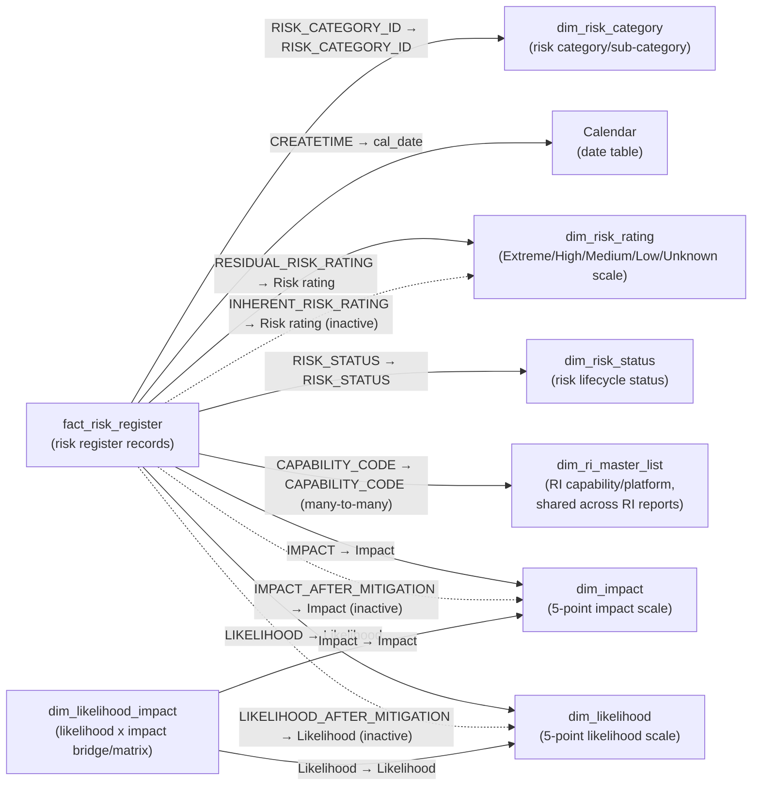

# Risk Data Model

The tables, relationships and source queries behind [[Risk]]. Eleven tables, twelve relationships, one fact.

The data dictionary below is transferred in full and is meant to be read as reference. The narrative sections above it explain the shape those tables sit in.

> [!note] Reconciled against [[ri_pbi_risk semantic model]] — last on 2026-09-15
> First reconciled 2026-09-10: all 12 tables, their columns and types, the 12 relationships (3 inactive), 19 measures and the 4 calculation items matched the export. Re-checked 2026-09-15: `Sheet1` — the standalone `Key Risks.xlsx` import — was removed as a loaded table and now exists only as an unloaded Power Query expression (still named `Sheet1`) that no table reaches, so the model is down to **11 tables**; the other 12 relationships, 19 measures and 4 calculation items are unaffected, since `Sheet1` never had a relationship. See the Sheet1 section below and [[Power BI upstream bindings]]. Go there for measure DAX and the Power Query expression inventory. Hidden flags, `toCardinality` and the `///` doc comments are not in it, and those claims still rest on the 2026-09-01 TMDL read.
>
> Re-checked 2026-09-19 against the 2026-09-19 export (`ri_pbi_risk` @ `75df1b25`). The sub-repo commit moved, but the export was rendered from the same source graph (`944e789f`) as the `11a98af` export this note was last reconciled against, and every file under `graphify/ri_pbi_production/` apart from `_meta.md` is byte-identical. So nothing the export shows has changed. It also means the export cannot show what that commit did change. Re-reading the body turned up one stale claim, corrected under *Source flow*: it said [[Survey]] has no helper at all. Survey has had `Databricks_MACE` and the two-argument `get_table_from_mace` since 2026-09-15, and [[Non-iLab Utilisation]] carries the same pair.

## The fact and its neighbours

`fact_risk_register` holds **one row per risk record version** — the register is slowly-changing, and the four `_START_TIMESTAMP`/`_EXPIRATION_TIMESTAMP`/`_ROW_ACTIVE_FLAG`/`_SURROGATE_KEY` columns carry that versioning.

A star schema with two snowflake extensions:

| Table | Role |
|---|---|
| `fact_risk_register` | The fact: risk register records |
| `dim_risk_category` | Risk category / sub-category |
| `dim_risk_status` | Risk lifecycle status |
| `dim_ri_master_list` | RI capability/platform, shared across the suite |
| `dim_impact` | 5-point impact scale — hardcoded literal |
| `dim_likelihood` | 5-point likelihood scale — hardcoded literal |
| `dim_risk_rating` | Extreme/High/Medium/Low/Unknown scale — hardcoded literal |
| `dim_likelihood_impact` | 25-row likelihood × impact bridge |
| `Calendar` | Date table |
| `KeyMeasures` | Measure container, no data |
| `Time intelligence` | Calculation group |

`Sheet1`, the standalone `Key Risks.xlsx` import, was removed as a loaded table on 2026-09-15 — it now exists only as an unloaded Power Query expression that no table reaches. See the Sheet1 section below.

## Relationships

Twelve. Ten fact → dimension, two dimension → dimension, three inactive.



`Sheet1` no longer appears as a table at all (see below), so there's nothing to omit. No relationship in this model is bidirectional.

### The three active/inactive pairs

Each rating dimension carries one active and one inactive link, so a measure can flip between the pre-mitigation and post-mitigation view with `USERELATIONSHIP`. **The orientation differs between them** — `dim_risk_rating` defaults to residual, the other two default to inherent. The full table is in [[Risk]]; it was re-derived from `relationships.tmdl` and is the single most important thing to check before writing DAX here.

Two measures do the flipping: `Inherent Risk` activates the `INHERENT_RISK_RATING` link, and `Post Mitigation Active Risks` activates both the `IMPACT_AFTER_MITIGATION` and `LIKELIHOOD_AFTER_MITIGATION` links. See [[Risk Measures]].

### The bridge table

`dim_likelihood_impact` is the model's snowflake extension, and it is unusual in running **dimension to dimension** — it hangs off `dim_likelihood` and `dim_impact` independently, with no path to the fact at all.

It is the 25-row cross-join of the two 5-point scales, carrying a computed `colour_code` (range 2–10) that almost certainly drives conditional formatting on a 5×5 risk-matrix heatmap. Because it does not touch the fact, the matrix it backs shows the *scale*, not the *data* — filtering the register does not filter this table.

### The master-list join

`fact_risk_register[CAPABILITY_CODE] → dim_ri_master_list[CAPABILITY_CODE]`, flagged `toCardinality: many`. Risk shares the `CAPABILITY_CODE` join key with [[Publication]] — see [[dim_ri_master_list Reference|dim_ri_master_list]] for how the key varies elsewhere.

Two things make this the tidiest master-list arrangement in the suite. The join key and **the RLS filter column are the same column**, so a role's filter reaches the fact through the same path a report filter does — unlike [[Awards]], where the role filters `ILAB_CAPABILITY_ID` and the relationship joins `ILAB_CORE_NAME`. And unlike [[Awards]] and [[Publication]], the single fact **is** reachable, so there is no unsecured-fact finding here.

Note the stale doc comment on `CAPABILITY_ID` claiming it is the join key. It isn't; nothing uses it. See [[Risk]].

## Source flow

All source queries live in `expressions.tmdl`, reading Databricks catalog `pen_research_infrastructure_insights_prd`, schema `ri_lakehouse`.

**Connection and helper.** `Databricks_MACE` holds the connection record, including `database = "ri_lakehouse"`. `get_table_from_mace(_a_table_name)` takes **only the table name** — the schema comes from the connection record, not a parameter. **Risk is the only repo in the suite with the single-argument signature**; [[Asset]], [[Awards]], [[Finance]], [[Publication]], [[iLab Utilisation]], [[Non-iLab Utilisation]] and — since 2026-09-15 — [[Survey]] all take two. Check before porting a call.

**Parameters.** `StartDate` = `#date(2000, 1, 1)` and `EndDate` = `#date(2027, 1, 1)` bound the `Calendar` range. A third, `data_path`, is orphaned — see [[Risk]].

**Core data flow.** Only two queries actually fetch from Databricks; the rest is local shaping.

1. `ri_grc_risk_register` (`fetch`) = `get_table_from_mace("risk_register")` — the raw register extract.
2. `risk_category` (`preprocess`) — selects `RISK_CATEGORY`/`RISK_SUB_CATEGORY` from it, removes duplicates, sorts, and adds a sequential `RISK_CATEGORY_ID` via `Table.AddIndexColumn` → **`dim_risk_category`**.
3. `risk_status` (`preprocess`) — distinct `RISK_STATUS` values → **`dim_risk_status`**.
4. `risk_register` (`preprocess`) — left-outer merges `ri_grc_risk_register` against `risk_category` on `{RISK_CATEGORY, RISK_SUB_CATEGORY}`, then expands `RISK_CATEGORY_ID` back onto the row → **`fact_risk_register`**.
5. `ri_lakehouse_ri_master_list` (`fetch`) = `get_table_from_mace("ri_master_list")` → **`dim_ri_master_list`**.
6. **`Calendar`** — built in the table's own partition rather than a named expression: `List.Dates(StartDate, Length, #duration(1,0,0,0))`, then derives `cal_year`, `cal_month`, `cal_month_name`, `MonthYear`, `cal_mon_yeat_int` (the typo is in the column name), `Day`, `Date`, `'Day of Week'`, `day_type`, `fiscal_year` (Australian July-start) and `fy_label`.
7. **`dim_impact`**, **`dim_risk_rating`**, **`dim_likelihood`** — hardcoded `#table(...)` literals, below.
8. **`dim_likelihood_impact`** — cross-joins `dim_likelihood` with `dim_impact` via `Table.AddColumn` embedding the whole table then `Table.ExpandTableColumn`, producing all 25 combinations. It then **inverts the likelihood sort order** with `(_ - 6) * -1` (mapping 1↔5, 2↔4, 3↔3) and computes `colour_code = [Likelihood sort] + [Impact sort]`.

`Sheet1` loaded from a local Excel workbook and was the repo's live path failure — see [[Risk]]. As of the 2026-09-15 export it is no longer loaded into any table; the expression still exists in `expressions.tmdl` but nothing reaches it.

**Note that `RISK_CATEGORY_ID` is generated locally**, by row index over a sorted distinct list. It is not a stable identifier from the source system: if the set of category/sub-category pairs changes upstream, existing IDs can shift. Anything that pins a category ID — a bookmark, a report filter, an external reference — should be re-checked after a source change.

### The three hardcoded scales

Not sourced from Databricks. Plain, uncompressed M literals — the same purpose as [[Asset]]'s base64 pinned snapshot, but readable in place:

```
dim_impact       {{"Insignificant",1},{"Minor",2},{"Moderate",3},{"Major",4},{"Catastrophic",5}}
dim_likelihood   {{"Almost Certain",1},{"Likely",2},{"Possible",3},{"Unlikely",4},{"Rare",5}}
dim_risk_rating  {{"Extreme",1,"Extreme Risk"},{"High",2,"High Risk"},{"Medium",3,"Medium Risk"},
                  {"Low",4,"Low Risk"},{"Unknown",5,"Unknown Risk"}}
```

Frozen reference lists, not meant to be hand-edited outside a deliberate scale change. Note `dim_risk_rating` carries an `"Unknown"` catch-all, which the counting measures in [[Risk Measures]] have to account for. Note also that `dim_likelihood`'s sort runs 1 = *Almost Certain*, i.e. most likely first — the opposite direction to `dim_impact`'s 1 = *Insignificant*, which is why `dim_likelihood_impact` inverts one of them before summing.

## Data dictionary

Every table and column in the model, transferred in full.

**Hidden** means not shown in the Fields pane. Sort-helper columns are those referenced by another column's `sortByColumn` property.

### fact_risk_register

Per its `///` doc comment: *"Core fact table containing one row per risk record version. Holds all fields captured in the risk register including risk description, scoring, residual rating, owner, controls, treatment plan, review dates, and status. This is the primary table used by all risk measures."* The table itself is **not hidden**.

| Column | Data type | Hidden | Description |
|---|---|---|---|
| CAPABILITY_ID | string | **No** | Per doc comment: *"Code identifying the research infrastructure capability that owns this risk (e.g. MPMP, MBI). Links to dim_ri_master_list to provide capability details."* **Caveat:** no relationship in `relationships.tmdl` actually uses this column — the real join to `dim_ri_master_list` is via `CAPABILITY_CODE` (below). This doc comment appears stale; see [[Risk]]. |
| CREATETIME | dateTime | **No** | Per doc comment: *"The date and time the risk record was first created in the system. Used to track when risks were logged and for trend measures like New Risks This Month."* Join key to `Calendar[cal_date]`. |
| CREATORNAME | string | **No** | Per doc comment: *"The full name of the person who originally created the risk record."* |
| ID | string | **No** | Per doc comment: *"The internal system identifier for the risk register instance (the form or template), not to be confused with the individual risk record ID."* |
| ISINARCHIVEDSTATUS | string | **No** | Per doc comment: *"Indicates whether the risk has been archived. A value of True means the risk is no longer active and has been moved to an archived state."* Drives the `Archived Risks` measure. |
| ISSUBMISSIONCOMPLETED | boolean | **No** | Per doc comment: *"A true/false flag indicating whether the risk record submission has been fully completed. Used in the % Submission Completed measure."* (No such measure currently exists in `KeyMeasures` — likely planned or removed; see [[Risk]].) |
| LASTUPDATERNAME | string | **No** | Per doc comment: *"The full name of the person who last edited or updated the risk record."* |
| LASTUPDATETIME | dateTime | **No** | Per doc comment: *"The date and time the risk record was most recently updated. Useful for auditing how recently each risk was maintained."* |
| OWNERDIVISION | string | **No** | Per doc comment: *"The division or organisational unit responsible for this risk (e.g. MBI, FLOW). Used in division-level filtering, the overdue-by-division chart, and the Overdue Rate by Division measure."* (No such measure currently exists in `KeyMeasures`; likely a report-page feature not reflected in the measures table, or removed — see [[Risk]].) |
| OWNERGROUPS | string | **No** | Per doc comment: *"A comma-separated list of all groups that have ownership or visibility of this risk, including admin and notification groups."* |
| RECORD_ID | string | **No** | Per doc comment: *"The unique identifier for each individual risk record. This is the primary key used by all count-based measures such as Total Risks, Active Risks, and Overdue Reviews."* Underlies `DISTINCTCOUNT` in `Total Risks`. |
| REGISTER_ID | string | **No** | Per doc comment: *"The identifier of the risk register that this record belongs to. Multiple risk records can belong to the same register."* |
| RESIDUAL_RISK_RATING | string | **No** | Per doc comment: *"The overall residual risk rating after controls have been applied. Values include High, Medium, and Low. This drives the risk rating breakdown measures and donut chart on Page 1."* Active join key to `dim_risk_rating['Risk rating']`. |
| TITLE | string | **No** | Per doc comment: *"The display title of the risk record as shown in the source system. Typically matches RISK_REGISTER_RISK_TITLE but may be the full form title rather than the individual risk title."* |
| _EXPIRATION_TIMESTAMP | dateTime | Yes | Per doc comment: *"The timestamp at which this row version expired and was superseded by a newer version. Used in slowly changing dimension (SCD) logic to track historical changes. Null means the row is currently active."* |
| _ROW_ACTIVE_FLAG | string | Yes | Per doc comment: *"A flag indicating whether this row is the current active version of the risk record. Used in conjunction with _START_TIMESTAMP and _EXPIRATION_TIMESTAMP for SCD versioning."* |
| _START_TIMESTAMP | dateTime | Yes | Per doc comment: *"The timestamp at which this row version became active. Together with _EXPIRATION_TIMESTAMP, this defines the period for which this version of the record was valid."* |
| _SURROGATE_KEY | int64 | Yes | Per doc comment: *"A system-generated integer key that uniquely identifies each row version in the fact table. Used internally for SCD joins and should not be used as a business identifier."* |
| RISK_CATEGORY_ID | int64 | **No** | Per doc comment: *"Foreign key linking this risk record to the dim_risk_category table. Used internally for the relationship join — not intended for display in visuals."* Despite the comment, this column is **not** flagged `isHidden` in the model. |
| INHERENT_RISK_RATING | string | **No** | No `///` doc comment (added after the documented block). The pre-mitigation counterpart to `RESIDUAL_RISK_RATING`; inactive join key to `dim_risk_rating['Risk rating']`, activated via `USERELATIONSHIP` in the `Inherent Risk` measure. |
| CONTROLS | string | **No** | No doc comment. Free-text description of the controls in place to manage the risk. |
| DATE_ELIMINATED | string | **No** | No doc comment. Date the risk was eliminated, stored as text rather than a date/dateTime type. |
| DATE_REPORTED | string | **No** | No doc comment. Date the risk was first reported, stored as text. |
| HOW_WAS_THE_RISK_ELIMINATED | string | **No** | No doc comment. Free-text explanation of how an eliminated risk was resolved. |
| IMPACT | string | **No** | No doc comment. Pre-mitigation (inherent) impact rating; active join key to `dim_impact[Impact]`. |
| IMPACT_AFTER_MITIGATION | string | **No** | No doc comment. Post-mitigation (residual) impact rating; inactive join key to `dim_impact[Impact]`, activated via `USERELATIONSHIP` in `Post Mitigation Active Risks`. |
| LIKELIHOOD | string | **No** | No doc comment. Pre-mitigation (inherent) likelihood rating; active join key to `dim_likelihood[Likelihood]`. |
| LIKELIHOOD_AFTER_MITIGATION | string | **No** | No doc comment. Post-mitigation (residual) likelihood rating; inactive join key to `dim_likelihood[Likelihood]`, activated via `USERELATIONSHIP` in `Post Mitigation Active Risks`. |
| MITIGATION_ACTIONS | string | **No** | No doc comment. Free-text description of actions taken/planned to mitigate the risk. |
| MITIGATION_STRATEGIES | string | **No** | No doc comment. Free-text description of the broader strategy for managing the risk. |
| RESIDUAL_RISK_SCORE | double | **No** | No doc comment. Numeric post-mitigation risk score (likely likelihood × impact); summed/averaged in `Avg Residual Risk Score`. |
| REVIEW_COMPLETED | string | **No** | No doc comment. Indicates whether the scheduled risk review has been completed. |
| RISK_CATEGORY | string | **No** | No doc comment. Plain-text risk category label (paired with `RISK_SUB_CATEGORY` to derive `RISK_CATEGORY_ID` upstream in the `risk_category`/`risk_register` M queries). |
| RISK_DESCRIPTION | string | **No** | No doc comment. Free-text description of the risk itself. |
| RISK_NUMBER | string | **No** | No doc comment. Business-facing risk reference number (distinct from the internal `RECORD_ID`). |
| RISK_OWNER | string | **No** | No doc comment. Name of the person accountable for managing the risk. |
| RISK_SCORE | double | **No** | No doc comment. Numeric pre-mitigation (inherent) risk score; averaged in `Avg Inherent Risk Score`. |
| RISK_STATUS | string | **No** | No doc comment. Current lifecycle status of the risk (e.g. "Monitor", "Eliminated"); join key to `dim_risk_status[RISK_STATUS]`, drives `Active Risks`/`Eliminated Risks`. |
| RISK_SUB_CATEGORY | string | **No** | No doc comment. Plain-text risk sub-category label, paired with `RISK_CATEGORY`. |
| RISK_TITLE | string | **No** | No doc comment. Individual risk title, concatenated across the current filter context in the `Risk titles` measure. |
| TARGET_DATE_FOR_NEXT_REVIEW | string | **No** | No doc comment. Target date (stored as text) for the risk's next scheduled review. |
| TREATABLE | string | **No** | No doc comment. Purpose unclear — review with model owner (likely a Yes/No flag on whether the risk can be further treated, but not stated explicitly anywhere in the model). |
| TREATMENT_OPTION | string | **No** | No doc comment. Purpose unclear — review with model owner (likely the chosen treatment strategy category, e.g. accept/mitigate/transfer/avoid, but not stated explicitly anywhere in the model). |
| CAPABILITY_CODE | string | **No** | No doc comment, despite being the **actual** relationship join key to `dim_ri_master_list[CAPABILITY_CODE]` (many-to-many) and the column every RLS role filters on. See the `CAPABILITY_ID` discrepancy note above and [[Risk]]. |

### dim_impact

Hardcoded 5-point impact scale (Insignificant → Catastrophic). The table itself is **not hidden**.

| Column | Data type | Hidden | Description |
|---|---|---|---|
| Impact | string | **No** | The impact label (`"Insignificant"`, `"Minor"`, `"Moderate"`, `"Major"`, `"Catastrophic"`); join key to the fact table's `IMPACT`/`IMPACT_AFTER_MITIGATION`. Sorted by `'Impact sort'`. |
| Impact sort | int64 | **No** *(sort-helper, but exposed)* | Numeric 1–5 sort order so `Impact` displays least-to-most severe instead of alphabetically. Unlike the equivalent sort-helper columns in `ri_pbi_asset`, this column is **not** flagged `isHidden` — it is fully visible in the Fields pane. See [[Risk]]. |

### dim_likelihood

Hardcoded 5-point likelihood scale (Almost Certain → Rare). The table itself is **not hidden**.

| Column | Data type | Hidden | Description |
|---|---|---|---|
| Likelihood | string | **No** | The likelihood label (`"Almost Certain"`, `"Likely"`, `"Possible"`, `"Unlikely"`, `"Rare"`); join key to the fact table's `LIKELIHOOD`/`LIKELIHOOD_AFTER_MITIGATION` and to `dim_likelihood_impact[Likelihood]`. Sorted by `'Likelihood sort'`. |
| Likelihood sort | int64 | **No** *(sort-helper, but exposed)* | Numeric 1–5 sort order (1 = Almost Certain) so `Likelihood` displays most-to-least likely instead of alphabetically. Not flagged `isHidden` — see [[Risk]]. |

### dim_likelihood_impact

Bridge/matrix table: the cross-join of `dim_likelihood` × `dim_impact` (25 rows), most likely backing a 5×5 risk-matrix heatmap visual. The table itself is **not hidden**. It also carries its own measure, `colour_value` (see [[Risk Measures]]) — a deviation from the "measures live in `KeyMeasures`" convention.

| Column | Data type | Hidden | Description |
|---|---|---|---|
| Likelihood | string | **No** | Copied from `dim_likelihood[Likelihood]`; join key back to `dim_likelihood[Likelihood]`. Sorted by `'Likelihood sort'`. |
| Likelihood sort | double | **No** *(sort-helper, but exposed)* | The likelihood sort value, **inverted** from `dim_likelihood`'s via `(_ - 6) * -1` (so 1↔5, 2↔4, 3↔3) before being combined into `colour_code`. Note the data type here is `double`, while the source `dim_likelihood[Likelihood sort]` is `int64` — a minor type inconsistency introduced by the M transform. |
| Impact | string | **No** | Copied from `dim_impact[Impact]`; join key back to `dim_impact[Impact]`. Sorted by `'Impact sort'`. |
| Impact sort | int64 | **No** *(sort-helper, but exposed)* | The impact sort value (1–5), carried through unchanged from `dim_impact`. |
| colour_code | int64 | **No** | `[Likelihood sort] + [Impact sort]` (range 2–10) — a combined severity score per likelihood/impact cell, almost certainly used to drive a colour gradient on the risk-matrix visual. |

### dim_ri_master_list

Shared cross-system reference table listing all RI capabilities (facilities/platforms), reused with different join keys across the RI reporting suite. Per its doc comment: *"Dimension table listing all research infrastructure capabilities. Each row represents a capability (e.g. a facility or instrument) with its codes, organisational node, cost centre, and identifiers used across integrated systems such as iLab, PURE, and Survey."* The table itself is **not hidden**.

**Notably, unlike `ri_pbi_asset` (which hides all but 5 of this table's columns), every column here is exposed — none are flagged `isHidden`.** This includes cross-system join keys that this repo never actually uses for its own joins (`SURVEY_CAPABILITY_ID` for `ri_pbi_survey`, `PURE_ORGANISATION_ID`/`PURE_FACILITY_NAME`/`PURE_FACILITY_ID` for `ri_pbi_publication`, `ILAB_CAPABILITY_ID`/`ILAB_CORE_NAME` for `ri_pbi_ilab_utilisation`, `FUND_ID` for `ri_pbi_finance`). This repo's own relationship — and its RLS roles — join/filter exclusively via `CAPABILITY_CODE`.

| Column | Data type | Hidden | Description |
|---|---|---|---|
| INDEX | int64 | **No** | Row sequence number from the source table; not used for reporting or joins. |
| CAPABILITY_CODE | string | **No** | Unique code identifying a capability (facility/platform), e.g. `MPMP`, `MBI`. **This is the join key this repo actually uses** — both for the `fact_risk_register` relationship (many-to-many) and as the filter column in every RLS role (see [[Risk RLS]]). |
| CAPABILITY_NAME | string | **No** | Display name of the capability. |
| NODE_ID | string | **No** | Org node identifier the capability belongs to; not used for any relationship in this model. |
| NODE_NAME | string | **No** | Display name of the organisational node/division. |
| COST_CENTRE_NAME | string | **No** | Name of the cost centre associated with the capability. |
| COST_CENTRE | string | **No** | Cost centre code; a cross-system join key used by `ri_pbi_asset`/`ri_pbi_finance`, not used for any relationship here. |
| FUND_ID | string | **No** | Fund identifier; cross-system join key for `ri_pbi_finance`, not used here. |
| CAPABILITY_ISO | string | **No** | ISO accreditation status/code for the capability. |
| CAPABILITY_TYPE | string | **No** | Classification of the capability (e.g. platform, facility, service). |
| CAPABILITY_GOVERNANCE | string | **No** | Governance model/committee the capability reports into. |
| SURVEY_CAPABILITY_ID | string | **No** | Cross-system join key for `ri_pbi_survey`, not used here. |
| PURE_ORGANISATION_ID | string | **No** | Cross-system join key to PURE research-organisation records, not used here. |
| PURE_FACILITY_NAME | string | **No** | Facility name in PURE, cross-system join key for `ri_pbi_publication`, not used here. |
| PURE_FACILITY_ID | int64 | **No** | Numeric PURE facility ID, cross-system join key for `ri_pbi_publication`, not used here. |
| ILAB_CAPABILITY_ID | string | **No** | Cross-system join key for `ri_pbi_ilab_utilisation`, not used here. |
| ILAB_CORE_NAME | string | **No** | Core facility name in iLab, cross-system join key for `ri_pbi_ilab_utilisation`, not used here. |
| RLS_FACILITY_GROUP | string | **No** | RLS group intended for facility-level access restriction. Present but **not** the column this repo's RLS roles actually filter on (they filter `CAPABILITY_CODE` directly — see [[Risk RLS]]). |
| RLS_FACULTY_GROUP | string | **No** | RLS group intended for faculty-level access restriction. Also present but unused by this repo's actual RLS roles. |

### dim_risk_category

Per its doc comment: *"Dimension table containing the distinct combinations of risk category and sub-category. Used to group and filter risks by category in visuals and measures."* The table itself is **not hidden**.

| Column | Data type | Hidden | Description |
|---|---|---|---|
| RISK_CATEGORY_ID | int64 | **No** | Per doc comment: *"Surrogate integer key linking the category dimension to the fact table. Used internally for the relationship join — not intended for display in visuals."* Despite this, the column is **not** flagged `isHidden`. Default label for the table. |
| RISK_CATEGORY | string | **No** | No doc comment. Top-level risk category label (e.g. safety, financial, operational). |
| RISK_SUB_CATEGORY | string | **No** | No doc comment. Sub-category label beneath `RISK_CATEGORY`. |

### dim_risk_rating

Hardcoded rating scale (Extreme/High/Medium/Low/Unknown). The table itself is **not hidden**.

| Column | Data type | Hidden | Description |
|---|---|---|---|
| Rating sort | int64 | **No** *(sort-helper, but exposed)* | Numeric 1–5 sort order (1 = Extreme) driving the display order of both `'Risk rating'` and `'Risk rating name'`. Not flagged `isHidden` — see [[Risk]]. |
| Risk rating | string | **No** | The short rating code (`"Extreme"`, `"High"`, `"Medium"`, `"Low"`, `"Unknown"`); join key to the fact table's `RESIDUAL_RISK_RATING`/`INHERENT_RISK_RATING`. Sorted by `'Rating sort'`. Default label for the table. |
| Risk rating name | string | **No** | The long-form label (`"Extreme Risk"`, `"High Risk"`, etc.) for display in visuals. Also sorted by `'Rating sort'`. |

### dim_risk_status

Per its doc comment: *"Dimension table listing the distinct risk status values (e.g. Monitor, Eliminated, Superseded). Used to filter and group risks by their current lifecycle status."* The table itself is **not hidden**.

| Column | Data type | Hidden | Description |
|---|---|---|---|
| RISK_STATUS | string | **No** | The status label (e.g. `"Monitor"`, `"Eliminated"`); join key to the fact table's `RISK_STATUS`. Default label for the table. |

### Calendar

Per its doc comment: *"Date dimension table used for time-based filtering and slicing. Each row represents a single calendar day with related attributes like year, month, fiscal year, and day type."* The table itself is **not hidden**. **Every column in this table is exposed — none are flagged `isHidden`**, unlike the equivalent `calendar` table in `ri_pbi_asset` where most attributes are hidden.

| Column | Data type | Hidden | Description |
|---|---|---|---|
| cal_date | dateTime | **No** | Per doc comment: *"The full calendar date. This is the primary date column used to link the Calendar table to other tables via relationships."* Join key to `fact_risk_register[CREATETIME]`. Default label for the table. |
| cal_year | int64 | **No** | Per doc comment: *"The calendar year number (e.g. 2024). Used for year-level filtering and grouping."* |
| cal_month | int64 | **No** | Per doc comment: *"The calendar month number (1 = January, 12 = December). Used for month-level filtering."* |
| cal_month_name | string | **No** | Per doc comment: *"The full name of the calendar month (e.g. March). Used as a display label in visuals."* |
| MonthYear | string | **No** | Per doc comment: *"A combined month and year label (e.g. Mar-2024). Useful for axis labels in trend charts."* |
| cal_mon_yeat_int | int64 | **No** | Per doc comment: *"An integer representation of the month and year (e.g. 202403 for March 2024). Used for sorting month/year combinations in the correct chronological order."* Note the typo in the column name itself (`yeat` instead of `year`). |
| Day | string | **No** | Per doc comment: *"The name of the day of the week (e.g. Monday). Used for day-level filtering and display."* |
| Date | int64 | **No** | Per doc comment: *"The day-of-month number (1–31). Used for display or sorting within a month."* |
| Day of Week | int64 | **No** | Per doc comment: *"The numeric position of the day within the week (e.g. 1 = Sunday or Monday depending on locale setting). Used for sorting days in the correct order."* |
| day_type | string | **No** | Per doc comment: *"Classifies each date as a weekday or weekend. Useful for filtering out non-business days in time-based analysis."* |
| fiscal_year | int64 | **No** | Per doc comment: *"The fiscal year the date belongs to. May differ from the calendar year depending on the organisation's financial year start."* Computed as calendar year + 1 for months ≥ July (Australian FY). |
| fy_label | string | **No** | Per doc comment: *"A readable label for the fiscal year (e.g. 2023/2024). Used as a display label in visuals when filtering or grouping by fiscal year."* |

### KeyMeasures

Per its doc comment: *"Central table holding all DAX measures for this report. It contains no data rows — it is purely a container to keep measures organised and separate from the data tables."* Not hidden. No user-facing columns — measures only, see [[Risk Measures]].

### Time intelligence

Per its doc comment: *"Helper table used to support time intelligence calculations and period comparisons such as month-to-date or year-to-date. Used internally by DAX measures."* Not hidden. This is a **calculation group** (not a regular measure table) — its "columns" are calculation-group metadata rather than data columns; its calculation items are documented in [[Risk Measures]].

| Column | Data type | Hidden | Description |
|---|---|---|---|
| Name | string | **No** | Per doc comment: *"The name of the time intelligence period (e.g. Month-to-Date, Year-to-Date). Used to drive period-selection slicers in the report."* Sorted by `Ordinal`. |
| Ordinal | int64 | Yes *(sort-helper)* | Numeric sort order controlling the display sequence of the calculation items in period-selection slicers. This is the one sort-helper column in the model that **is** correctly flagged `isHidden`, unlike the `*_sort` columns on `dim_impact`/`dim_likelihood`/`dim_risk_rating` above. |

### Sheet1 (no longer a table, as of 2026-09-15)

Previously a raw import of the local `Key Risks.xlsx` workbook's `Sheet1` — see the local file gotcha in [[Risk]] — loaded as a standalone table with no relationship to `fact_risk_register`, seemingly an executive "key risks" list. As of the 2026-09-15 export it has been dropped from the model's tables: `expressions.tmdl` still defines a `Sheet1` query pointing at the same workbook, but it is now unloaded — no table's partition references it, and [[Power BI upstream bindings]] lists it as an "unloaded query" rather than "loaded." Its former columns (`Focus Area`, `Key Risk`, `Implication`, `Progress`) are no longer in the Fields pane. Whether this was a deliberate removal or an accidental drop hasn't been confirmed with the model owner.

## See also

- [[Risk]] — the repo entry note, including the stale `Key Risks.xlsx` path
- [[Risk Measures]] — the measure inventory built on these tables
- [[Risk RLS]] — the role roster and the master-list join it travels through
- [[dim_ri_master_list Reference|dim_ri_master_list]] — the shared identity table, joined here on `CAPABILITY_CODE`
- [[Shared Conventions]] — the PBIP layout and Databricks source pattern
- [[ri_pbi_risk semantic model]] — the exported model (derived, never hand-edited): every column and type, measure DAX, relationships and Power Query expressions
- **Derived layer** (`graphify/`, never hand-edited): [[_COMMUNITY_Risk Register Pipeline]], [[_COMMUNITY_Risk Impact Dimension]], [[_COMMUNITY_Risk Likelihood Dimension]], [[_COMMUNITY_Risk Rating Dimension]], [[_COMMUNITY_Risk Status Mapping]], [[_COMMUNITY_Risk Category Mapping]], [[fact_risk_register]], [[dim_risk_rating]], [[dim_impact]], [[dim_likelihood]], [[dim_ri_master_list_1]], [[risk_register]], [[risk_category]], [[risk_status]], [[ri_grc_risk_register]], `Key Risks.xlsx` *(source workbook; no node since export `51b1e84`)*, [[ri_lakehouse_ri_master_list]], [[Databricks_MACE_2]], [[get_table_from_mace_2]]
- **Derived layer — more M queries** (`graphify/`, never hand-edited): [[data_path_4]], [[StartDate_5]], [[EndDate_5]]
