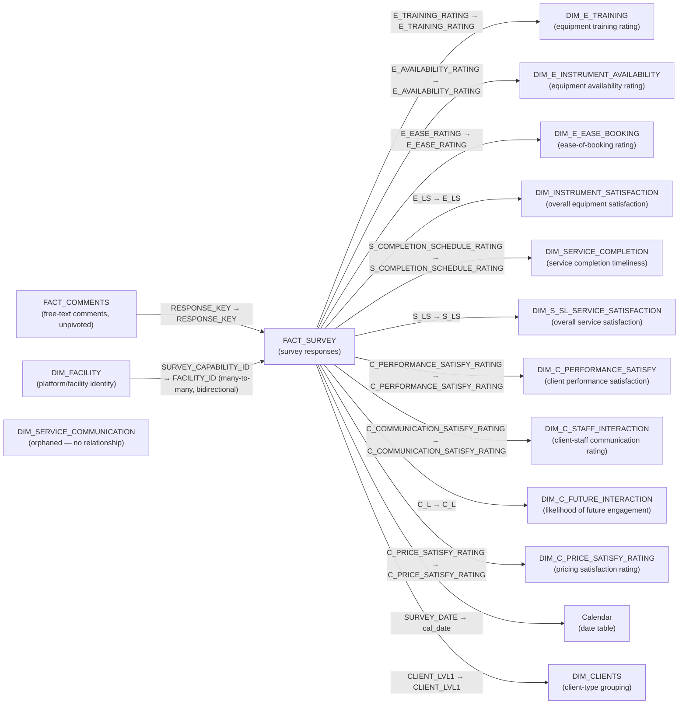

# Survey Data Model

The tables, relationships and source queries behind [[Survey]]. Seventeen tables — the most in the suite — fourteen relationships, two facts.

The data dictionary below is transferred in full and is meant to be read as reference. The narrative sections above it explain the shape those tables sit in.

> [!note] Reconciled against [[ri_pbi_survey semantic model]] — last on 2026-09-15
> First reconciled 2026-09-10: all 17 tables, their columns and types, the 14 relationships (one bidirectional) and 21 measures — including the non-functional `DIM_FACILITY[Measure]` — matched the export. Re-checked 2026-09-15, and `DIM_FACILITY` changed substantially: its `base_facility` query now calls `get_table_from_mace("ri_master_list", "ri_lakehouse")` on the shared warehouse, same as the other six repos, instead of the old hardcoded `ilab`-schema/second-warehouse path — and a `Databricks_MACE` record plus `get_table_from_mace` function now exist in this repo's `expressions.tmdl`, which the "no shared connection helper" claim below no longer describes accurately. `DIM_FACILITY` widened from 6 to 25 columns, gaining `CAPABILITY_CODE` and `NODE_ID` among others — see the rewritten sections below. Table, relationship and measure counts are otherwise unchanged. Go there for measure DAX and the Power Query expression inventory. Hidden flags, `toCardinality` and descriptions are not in it, and the visibility caveat in the data dictionary still applies.
>
> Re-checked 2026-09-19 against the 2026-09-19 export (`ri_pbi_survey` @ `403de545`). The sub-repo commit moved, but the export was rendered from the same source graph (`944e789f`) as the `11a98af` export this note was last reconciled against, and every file under `graphify/ri_pbi_production/` apart from `_meta.md` is byte-identical. So nothing the export shows has changed. It also means the export cannot show what that commit did change. Re-reading the body: its present-tense "the other six repos" read the same physical table predates [[Non-iLab Utilisation]], so it now says seven.

## The two facts

| Fact | Grain |
|---|---|
| `FACT_SURVEY` | One row per survey response |
| `FACT_COMMENTS` | One row per non-blank free-text comment, unpivoted from the same source |

`FACT_SURVEY` is the hub. `FACT_COMMENTS` hangs off it through a composite `RESPONSE_KEY` — `RESPONSEID` and `FACILITY_ID` joined with a `|`, derived independently in both partitions.

The 13 dimensions divide into three groups: `DIM_FACILITY` (platform identity), `DIM_CLIENTS` (client-type grouping), and **eleven per-question rating dimensions**, one for each survey question, ten of them connected and one orphaned. `Calendar` is the date table; `Key measures` is an empty container.

## Relationships

Fourteen. Thirteen are ordinary single-direction dimension → fact.



### The one bidirectional relationship

`FACT_SURVEY` ↔ `DIM_FACILITY` is the exception, and it is exceptional twice over: it is the model's only **many-to-many** relationship *and* its only **bidirectional** one (`crossFilteringBehavior: bothDirections`).

Filters therefore flow both ways. Selecting a facility filters responses, as expected — but filtering responses (by year, by rating) also filters which facility rows count as in-context. That is what lets `'Selected Capability'` read a facility name back out of `FACT_SURVEY`-side filters with `SELECTEDVALUE(DIM_FACILITY[SURVEY_CAPABILITY_ID])`.

It also matters for security. Every role in [[Survey RLS]] filters `DIM_FACILITY`, and this is the relationship that carries that restriction to the responses. The [[RLS Alignment Audit]] singles it out as the one relationship in the suite worth verifying with a role-impersonated query, precisely because a bidirectional many-to-many is harder to reason about statically than the one-directional links everywhere else.

### The orphaned dimension

`DIM_SERVICE_COMMUNICATION` is drawn as an isolated node deliberately. It is built identically to its nine connected siblings — same shape, same `legend()` treatment — but `relationships.tmdl` gives it no relationship at all, because `FACT_SURVEY` has no `SERVICE_COMMUNICATION` column to join to.

Its only consumer is the hidden `'Selected service communication'` measure, which is therefore disconnected from the filter graph, and neither the table nor the measure appears in any report visual. Debris from a retired survey question. See [[Survey]].

## `DIM_FACILITY`, and what it isn't

This used to be the repo's defining choice: every other repo carries `dim_ri_master_list` (or iLab's renamed copy); Survey built `DIM_FACILITY` instead, from a different physical path. As of the 2026-09-15 export, the physical-path difference is gone — `DIM_FACILITY` now reads the same table the same way the other seven do — but the model-side table is still named `DIM_FACILITY`, not `dim_ri_master_list`, and it is still reshaped, not a plain copy.

> [!warning] Resolved discrepancy — repointed on 2026-09-15
> Before this export, step 1 below read `ri_lakehouse_ri_master_list`, which hit schema **`ilab`** on SQL warehouse **`1fb6bc7e83d60086`** and selected only `CAPABILITY_NAME`, `NODE_NAME`, `CAPABILITY_TYPE`, `CAPABILITY_GOVERNANCE`, `SURVEY_CAPABILITY_ID`. That path — and the second warehouse — are still present in the model as unloaded expressions (`Merge1`, `ri_lakehouse_ri_master_list`, `ri_lakehouse_ri_master_list (2)`; see [[pen_research_infrastructure_insights_prd.ilab.ri_master_list]]), but nothing loads through them any more.

It is derived from the same physical source [[dim_ri_master_list Reference|dim_ri_master_list]] used by the other seven repos, in three steps:

1. `base_facility` calls `ri_master_list`, which calls `get_table_from_mace("ri_master_list", "ri_lakehouse")` — the same helper, catalog and warehouse the other seven repos use, returning the full 24-column raw shape (the 19 base columns plus the five `_`-prefixed SCD2 columns).
2. `base_facility` adds two computed flags, `PLATFORM` and `NON_PLATFORM`, derived from `CAPABILITY_TYPE`. The exact composition of `base_facility` beyond that isn't captured in this export (only table partitions carry their M text; shared-expression bodies don't), so whether it also filters to non-null `SURVEY_CAPABILITY_ID` — as the pre-2026-09-15 version did — can't be confirmed from the TMDL alone.
3. `DIM_FACILITY` **drops the original `CAPABILITY_NAME` and renames `NODE_NAME` into its place** — this step is unchanged.

What's changed and what hasn't:

- **The `CAPABILITY_NAME` in this model is still the source table's `NODE_NAME`.** It is not the same string other repos show under that heading.
- **`CAPABILITY_CODE` and `NODE_ID` now exist**, along with the rest of the raw 24-column shape (`COST_CENTRE`, `FUND_ID`, `ILAB_CAPABILITY_ID`, `ILAB_CORE_NAME`, `PURE_*`, `RLS_*`, `INDEX`, and the five SCD2 columns) — the identifiers every other repo's roles filter on are now present here too, though [[Survey RLS]] has not been re-checked against this export to see whether any role has started using them. The claim that the normalisation initiative "had nothing to work with" needs re-verifying.
- **Whether the table still holds only survey-relevant rows** (filtered to non-null `SURVEY_CAPABILITY_ID`) is unconfirmed post-widening — see point 2 above.

The other seven repos read the same `ri_lakehouse.ri_master_list` on the same warehouse; Survey's `base_facility` now does too.

## Source flow

All source queries live in `expressions.tmdl`.

**Shared connection helper, as of 2026-09-15.** This repo now has a `Databricks_MACE` record and a `get_table_from_mace` function, used by `DIM_FACILITY`'s `base_facility`/`ri_master_list` chain — the same pattern the other seven repos use. Before this export, the repo had neither: both Databricks queries repeated the full call inline, hitting a different warehouse directly:

```
Databricks.Catalogs("adb-3993465269917932.12.azuredatabricks.net", "/sql/1.0/warehouses/1fb6bc7e83d60086", [Catalog=null, Database=null, QueryTags=null, EnableAutomaticProxyDiscovery=null, Implementation=null])
```

That inline call still exists in the model, in the now-unloaded `ri_lakehouse_ri_master_list` expressions (see the warning above) — it just no longer feeds `DIM_FACILITY`. The other helper still defined and used is `legend(col_name)` — `Text.Proper(col_name)` — which every rating dimension calls to build its `LEGEND` display label. Three further helpers (`clean_table`, `prep_survey_questions`, `prep_base_survey`) are dead; see [[Survey]].

**Parameters.** `StartDate` = `#date(2017, 1, 1)`, `EndDate` = `#date(2026, 1, 1)`, bounding `Calendar`. A third, `data_path`, feeds only the dead `DEV` chain.

**Core data flow.**

1. `base_ri_survey` reads catalog `pen_research_infrastructure_insights_prd` → schema `survey` → table `ri_survey`: the raw survey export, response metadata, ratings and free text. It feeds both facts **independently**.
2. **`FACT_SURVEY`** cleans `COMBINED_FACILITY_COMMENT` with `Text.Clean`, filters out rows where `FACILITY_ID` is `"OFFICE"` or `"Q"` (test/internal), then derives `RESPONSE_KEY` = `Text.Combine({[RESPONSEID], [FACILITY_ID]}, "|")`.
3. **`FACT_COMMENTS`** re-reads and re-cleans `base_ri_survey` rather than referencing `FACT_SURVEY`: filters `OFFICE`/`Q` rows (case-insensitively **this time**), keeps only the free-text reason columns, drops rows where every one is blank, empty or `"."`, renames each to a plain-English category label (`E_AVAILABILITY_REASON` → `"EQUIPMENT AVAILABILITY"`), derives the same `RESPONSE_KEY`, and unpivots into `COMMENT_CATEGORY`/`COMMENT` pairs.
4. `ri_master_list` (= `get_table_from_mace("ri_master_list", "ri_lakehouse")`), 5. `base_facility`, 6. **`DIM_FACILITY`** — as described above.
7. `satisfaction_rating`, `likelyhood_rating`, `timely_rating`, `effective_rating` (`pre_process`) — small hardcoded label→sort-order lists, e.g. `{{"VERY SATISFIED", 5}, {"SATISFIED", 4}, {"NEUTRAL", 3}, {"DISSATISFIED", 2}, {"VERY DISSATISFIED", 1}}`. Each is wrapped in a `#table(...)` constructor inside its own rating dimension's partition, with `legend()` supplying the display label.

**The two facts are built by two independent passes over the same source, and they filter differently** — one case-sensitively, one not. They can therefore disagree about which responses exist. Worth knowing before reconciling a comment count against a response count.

There are **no static or base64-compressed reference snapshots** in this repo. The rating lists are the nearest equivalent, and they are plain literals.

## Data dictionary

Every table and column in the model, transferred in full.

**Hidden** means not shown in the Fields pane. Note the caveat in [[Survey]]: the hidden/visible values below follow the source documentation, which reads `changedProperty = IsHidden` markers as hiding. No object in this model carries an actual `isHidden` flag in TMDL.

### FACT_SURVEY

Fact table: one row per survey response. Not hidden — and unusually, no individual column in this table is hidden either (every raw Qualtrics-export field is exposed in the Fields pane).

| Column | Data type | Hidden | Description |
|---|---|---|---|
| A_F | string | **No** | Free-text "Additional Feedback" — general open-ended comment not tied to a specific rating; surfaced in `FACT_COMMENTS` as `"ADDITIONAL FEEDBACK"`. |
| C_COMMUNICATION_SATISFY_RATING | string | **No** | Client's satisfaction rating for staff communication/interaction (5-point satisfaction scale); join key to `DIM_C_STAFF_INTERACTION`. |
| C_COMMUNICATION_SATISFY_REASON | string | **No** | Free-text reason behind the communication-satisfaction rating; surfaced in `FACT_COMMENTS` as `"OVERALL COMMUNICATION"`. |
| C_L | string | **No** | Client's rated likelihood of future engagement with the platform (5-point likelihood scale); join key to `DIM_C_FUTURE_INTERACTION`. |
| C_PERFORMANCE_SATISFY_RATING | string | **No** | Client's satisfaction rating for the platform's overall performance (5-point satisfaction scale); join key to `DIM_C_PERFORMANCE_SATISFY`. |
| C_PERFORMANCE_SATISFY_REASON | string | **No** | Free-text reason behind the performance-satisfaction rating; surfaced in `FACT_COMMENTS` as `"OVERALL PERFORMANCE"`. |
| C_PRICE_SATISFY_RATING | string | **No** | Client's satisfaction rating for pricing (5-point satisfaction scale); join key to `DIM_C_PRICE_SATISFY_RATING`. |
| C_PRICE_SATISFY_REASON | string | **No** | Free-text reason behind the pricing-satisfaction rating; surfaced in `FACT_COMMENTS` as `"OVERALL PRICING"`. |
| C_SOE | string | **No** | Which category(ies) — Service and/or Equipment — this response's ratings apply to (values include `"SERVICE"`, `"EQUIPMENT"`, `"SERVICE,EQUIPMENT"`); drives the `Service`/`Equipment` response-count measures. |
| CLIENT | string | **No** | Client organisation name/category selected by the respondent; source column for the derived `CLIENT_LVL1` grouping column. |
| CLIENT_FROM | string | **No** | Purpose unclear — review with model owner. |
| CLIENT_FROM_0_TEXT | string | **No** | Purpose unclear — review with model owner (naming follows the Qualtrics "please specify" write-in convention tied to a choice-index-0 option on `CLIENT_FROM`, but this can't be confirmed from the TMDL alone). |
| COMBINED_FACILITY_COMMENT | string | **No** | Combined free-text comment field for facility-level feedback; cleaned via `Text.Clean` in the M partition. Not otherwise transformed downstream. |
| COMBINED_INSTRUMENT_COMMENT | string | **No** | Combined free-text comment field for instrument/equipment-level feedback. |
| COMBINED_SERVICE_COMMENT | string | **No** | Combined free-text comment field for service-level feedback. |
| DURATION_IN_SECONDS | int64 | **No** | Total time (seconds) the respondent spent on the survey; standard Qualtrics metadata. |
| E_AVAILABILITY_RATING | string | **No** | Client's satisfaction rating for equipment/instrument availability (5-point satisfaction scale); join key to `DIM_E_INSTRUMENT_AVAILABILITY`. |
| E_AVAILABILITY_REASON | string | **No** | Free-text reason behind the availability rating; surfaced in `FACT_COMMENTS` as `"EQUIPMENT AVAILABILITY"`. |
| E_EASE_RATING | string | **No** | Client's satisfaction rating for ease of booking equipment (5-point satisfaction scale); join key to `DIM_E_EASE_BOOKING`. |
| E_EASE_REASON | string | **No** | Free-text reason behind the ease-of-booking rating; surfaced in `FACT_COMMENTS` as `"EASE OF BOOKING"`. |
| E_F | string | **No** | Free-text general equipment feedback; surfaced in `FACT_COMMENTS` as `"EQUIPMENT FEEDBACK"`. |
| E_LS | string | **No** | Client's overall equipment/instrument satisfaction rating (5-point satisfaction scale); join key to `DIM_INSTRUMENT_SATISFACTION`. |
| E_TRAINING_RATING | string | **No** | Client's satisfaction rating for equipment training received (5-point satisfaction scale); join key to `DIM_E_TRAINING`. |
| E_TRAINING_REASON | string | **No** | Free-text reason behind the training rating; surfaced in `FACT_COMMENTS` as `"EQUIPMENT TRAINING"`. |
| ENDDATE | dateTime | **No** | Timestamp the respondent finished/submitted the survey; standard Qualtrics metadata. |
| EXTERNALREFERENCE | string | **No** | Qualtrics external reference/panel identifier for the respondent, if supplied. |
| FACILITIES_USED | int64 | **No** | Count of facilities the respondent indicated using. |
| FACILITY_ID | string | **No** | Code identifying the platform/facility this response relates to; join key (many-to-many, bidirectional) to `DIM_FACILITY[SURVEY_CAPABILITY_ID]` — the column every RLS role ultimately restricts via `DIM_FACILITY`. |
| FINISHED | boolean | **No** | Whether the respondent completed the entire survey; drives the `'Completed survey'` measure. |
| IMPROVEMENT | string | **No** | Free-text suggestion for what the platform could improve. |
| NEW_ITEMS | string | **No** | Free-text suggestion for new equipment/services the respondent would like to see. |
| PLATFORMS_USED | string | **No** | Free-text/list of platforms the respondent indicated using. |
| PROGRESS | int64 | **No** | Percentage of the survey the respondent completed (Qualtrics progress metric). |
| RECORDEDDATE | dateTime | **No** | Timestamp Qualtrics recorded the response. |
| RESPONSEID | string | **No** | Unique Qualtrics response identifier; combines with `FACILITY_ID` to build `RESPONSE_KEY`. |
| S_COMPLETION_SCHEDULE_RATING | string | **No** | Client's rating of whether the service was completed on schedule (3-point scale: ahead of schedule/on time/delayed); join key to `DIM_SERVICE_COMPLETION`. |
| S_COMPLETION_SCHEDULE_REASON | string | **No** | Free-text reason behind the completion-schedule rating; surfaced in `FACT_COMMENTS` as `"SERVICE COMPLETION"`. |
| S_F | string | **No** | Free-text general service feedback; surfaced in `FACT_COMMENTS` as `"OVERALL SERVICE"`. |
| S_LS | string | **No** | Client's overall service satisfaction rating (5-point satisfaction scale); join key to `DIM_S_SL_SERVICE_SATISFACTION`. |
| SELECTED_PLATFORM | string | **No** | The specific platform the respondent selected/was routed to for this survey instance. |
| STARTDATE | dateTime | **No** | Timestamp the respondent started the survey; standard Qualtrics metadata. |
| SURVEY_DATE | dateTime | **No** | Date of the survey response; join key to `Calendar[cal_date]`. |
| TOTAL_MINUTES | double | **No** | Total survey completion time in minutes; used by `'Average completion Time'` (filtered to under 60 minutes to exclude abandoned/left-open sessions). |
| UNANSWEREDPERCENTAGE | double | **No** | Percentage of survey questions the respondent left unanswered. |
| UNANSWEREDQUESTIONS | string | **No** | Text/list of which specific questions were left unanswered. |
| USER_DETAILS_1 | string | **No** | Purpose unclear — review with model owner. |
| USER_DETAILS_2 | string | **No** | Purpose unclear — review with model owner. |
| YEAR | int64 | **No** | Calendar year of the response; drives the year-based measures (`'Response (%)'`, `'Service (%)'`, etc.) directly via `FACT_SURVEY[YEAR]` rather than through `Calendar`. |
| RESPONSE_KEY | string | **No** | Derived key = `RESPONSEID` & `"\|"` & `FACILITY_ID`, built in the M partition; join key to `FACT_COMMENTS[RESPONSE_KEY]`. |
| CLIENT_LVL1 | string (calculated) | **No** | `SWITCH` expression grouping raw `CLIENT` values into broad categories (GOVERNMENT, INDUSTRY/CORPORATES, MONASH UNIVERSITY, MRI, OTHER, PFRO, UNIVERSITY, or the raw value as fallback); join key to `DIM_CLIENTS[CLIENT_LVL1]`. Built via Power BI's "group" UI (carries `GroupingMetadata`/`GroupingDesignState` extended properties). |

### FACT_COMMENTS

Fact table: one row per non-blank free-text comment, unpivoted from `base_ri_survey`'s reason/feedback columns. Not hidden; no columns hidden.

| Column | Data type | Hidden | Description |
|---|---|---|---|
| RESPONSE_KEY | string | **No** | Same composite key as `FACT_SURVEY[RESPONSE_KEY]`; join key back to `FACT_SURVEY`. |
| COMMENT_CATEGORY | string | **No** | Plain-English label for which survey question this comment answers (e.g. `"EQUIPMENT AVAILABILITY"`, `"OVERALL SERVICE"`), derived from unpivoting the renamed reason/feedback columns. |
| COMMENT | string | **No** | The free-text comment itself; blank/placeholder values (`null`, `""`, `"."`) are filtered out upstream so every row has real content. |

### DIM_C_FUTURE_INTERACTION

One row per likelihood-rating value used for `FACT_SURVEY[C_L]` ("likelihood of future engagement"). Not hidden.

| Column | Data type | Hidden | Description |
|---|---|---|---|
| C_L | string | **No** | Raw likelihood-rating value (e.g. `"VERY LIKELY"` … `"VERY UNLIKELY"`), sorted by `SORT_ORDER`; join key to `FACT_SURVEY[C_L]`. |
| SORT_ORDER | int64 | **No** *(sort-helper)* | Numeric rank (5 = Very Likely down to 1 = Very Unlikely) from the `likelyhood_rating` list; controls display order of `C_L` and `LEGEND`. Not hidden in this table, unlike the sort-helper convention used in `ri_pbi_asset`. |
| LEGEND | string | **No** | `Text.Proper()`-cased display label for `C_L` (via the shared `legend()` function); itself sorted by `SORT_ORDER`. |

### DIM_C_PERFORMANCE_SATISFY

One row per satisfaction-rating value used for `FACT_SURVEY[C_PERFORMANCE_SATISFY_RATING]`. Not hidden.

| Column | Data type | Hidden | Description |
|---|---|---|---|
| C_PERFORMANCE_SATISFY_RATING | string | **No** | Raw satisfaction-rating value (5-point scale), sorted by `SORT_ORDER`; join key to `FACT_SURVEY[C_PERFORMANCE_SATISFY_RATING]`. |
| SORT_ORDER | int64 | **No** *(sort-helper)* | Numeric rank (5 = Very Satisfied down to 1 = Very Dissatisfied); controls display order of the rating column. |
| LEGEND | string | **No** | `Text.Proper()`-cased display label for the rating value. |

### DIM_C_PRICE_SATISFY_RATING

One row per satisfaction-rating value used for `FACT_SURVEY[C_PRICE_SATISFY_RATING]`. Not hidden.

| Column | Data type | Hidden | Description |
|---|---|---|---|
| C_PRICE_SATISFY_RATING | string | **No** | Raw satisfaction-rating value (5-point scale), sorted by `SORT_ORDER`; join key to `FACT_SURVEY[C_PRICE_SATISFY_RATING]`. |
| SORT_ORDER | int64 | **No** *(sort-helper)* | Numeric rank controlling display order of the rating column. |
| LEGEND | string | **No** | `Text.Proper()`-cased display label for the rating value. |

### DIM_C_STAFF_INTERACTION

One row per satisfaction-rating value used for `FACT_SURVEY[C_COMMUNICATION_SATISFY_RATING]`. Not hidden.

| Column | Data type | Hidden | Description |
|---|---|---|---|
| C_COMMUNICATION_SATISFY_RATING | string | **No** | Raw satisfaction-rating value (5-point scale), sorted by `SORT_ORDER`; join key to `FACT_SURVEY[C_COMMUNICATION_SATISFY_RATING]`. |
| SORT_ORDER | int64 | **No** *(sort-helper)* | Numeric rank controlling display order of the rating column. |
| LEGEND | string | **No** | `Text.Proper()`-cased display label for the rating value. |

### DIM_CLIENTS

Calculated dimension (`ALL(FACT_SURVEY[CLIENT_LVL1])`) grouping client organisations into broader categories. Not hidden.

| Column | Data type | Hidden | Description |
|---|---|---|---|
| CLIENT_LVL1 | string (name-inferred) | **No** | Distinct values of `FACT_SURVEY[CLIENT_LVL1]`; join key back to `FACT_SURVEY[CLIENT_LVL1]`. |
| CLIENT_LVL2 | string (calculated) | **No** | Further-rolled-up `SWITCH` grouping of `CLIENT_LVL1` into six top-level categories (GOVERNMENT, INDUSTRY, MONASH UNIVERSITY, OTHER, RESEARCH INSTITUTES [MRI+PFRO], UNIVERSITIES). Built via Power BI's "group" UI. |

### DIM_E_EASE_BOOKING

One row per satisfaction-rating value used for `FACT_SURVEY[E_EASE_RATING]`. **Table is hidden in its entirety** (`changedProperty = IsHidden` at the table level) — the only rating dimension in this model hidden this way.

| Column | Data type | Hidden | Description |
|---|---|---|---|
| E_EASE_RATING | string | Yes | Raw satisfaction-rating value (5-point scale), sorted by `SORT_ORDER`; join key to `FACT_SURVEY[E_EASE_RATING]`. |
| SORT_ORDER | int64 | Yes *(sort-helper)* | Numeric rank controlling display order of the rating column. |
| LEGEND | string | Yes | `Text.Proper()`-cased display label for the rating value. |

### DIM_E_INSTRUMENT_AVAILABILITY

One row per satisfaction-rating value used for `FACT_SURVEY[E_AVAILABILITY_RATING]`. Not hidden.

| Column | Data type | Hidden | Description |
|---|---|---|---|
| E_AVAILABILITY_RATING | string | **No** | Raw satisfaction-rating value (5-point scale), sorted by `SORT_ORDER`; join key to `FACT_SURVEY[E_AVAILABILITY_RATING]`. |
| SORT_ORDER | int64 | **No** *(sort-helper)* | Numeric rank controlling display order of the rating column. |
| LEGEND | string | **No** | `Text.Proper()`-cased display label for the rating value. |

### DIM_E_TRAINING

One row per satisfaction-rating value used for `FACT_SURVEY[E_TRAINING_RATING]`. Not hidden.

| Column | Data type | Hidden | Description |
|---|---|---|---|
| E_TRAINING_RATING | string | **No** | Raw satisfaction-rating value (5-point scale), sorted by `SORT_ORDER`; join key to `FACT_SURVEY[E_TRAINING_RATING]`. |
| SORT_ORDER | int64 | **No** *(sort-helper)* | Numeric rank controlling display order of the rating column. |
| LEGEND | string | **No** | `Text.Proper()`-cased display label for the rating value. |

### DIM_FACILITY

This repo's platform-identity table — standing in for the shared `dim_ri_master_list` used elsewhere in the suite. As of 2026-09-15 it is built by reshaping the *same physical path* as the other six repos' copies (see [[#DIM_FACILITY, and what it isn't]]), where it previously used a separate schema and warehouse. Not hidden. **Widened from 6 to 25 columns on 2026-09-15** — the six below are still current and their hidden status (all visible) was verified against the 2026-09-01 TMDL read, before the widening; the 19 new columns' hidden status has not been checked against live TMDL.

| Column | Data type | Hidden | Description |
|---|---|---|---|
| CAPABILITY_NAME | string | **No** | Display name of the platform/facility. Note: sourced from the source table's `NODE_NAME` (renamed in the M partition), not from `ri_master_list`'s own `CAPABILITY_NAME` column, which is dropped — see [[#Source flow]] step 6. |
| CAPABILITY_TYPE | string | **No** | Classification of the capability (`"PLATFORM"` or `"NON-PLATFORM"`); source for the derived `PLATFORM`/`NON_PLATFORM` flag columns. |
| CAPABILITY_GOVERNANCE | string | **No** | Governance body the capability reports into (e.g. `"CENTRAL"`, `"MIPS"`, `"MNHS"`); filter column for the three admin RLS roles. |
| SURVEY_CAPABILITY_ID | string | **No** | Unique code identifying the platform/facility for survey purposes; join key (many-to-many, bidirectional) to `FACT_SURVEY[FACILITY_ID]`, and the filter column for every per-platform RLS role. |
| PLATFORM | int64 | **No** | 1 if `CAPABILITY_TYPE = "PLATFORM"`, else 0; derived flag for platform-vs-non-platform breakdowns. |
| NON_PLATFORM | int64 | **No** | 1 if `CAPABILITY_TYPE = "NON-PLATFORM"`, else 0; derived flag for platform-vs-non-platform breakdowns. |
| CAPABILITY_CODE | string | *(unverified)* | Unique code identifying a capability (facility/platform) — added to the export on 2026-09-15; this repo did not carry it before. Not confirmed whether any RLS role now uses it — see [[Survey RLS]]. |
| NODE_ID | string | *(unverified)* | Organisational node identifier — added 2026-09-15. |
| COST_CENTRE | string | *(unverified)* | SAP cost centre code — added 2026-09-15. |
| COST_CENTRE_NAME | string | *(unverified)* | Name of the cost centre — added 2026-09-15. |
| FUND_ID | string | *(unverified)* | Fund identifier — added 2026-09-15. |
| CAPABILITY_ISO | string | *(unverified)* | ISO accreditation status/code — added 2026-09-15. |
| ILAB_CAPABILITY_ID | string | *(unverified)* | Cross-system join key for `ri_pbi_ilab_utilisation` — added 2026-09-15. |
| ILAB_CORE_NAME | string | *(unverified)* | Core facility name in iLab — added 2026-09-15. |
| INDEX | int64 | *(unverified)* | Row sequence number from the source table; dead elsewhere in the suite (see [[dim_ri_master_list Reference|dim_ri_master_list]]) — added 2026-09-15. |
| PURE_ORGANISATION_ID | string | *(unverified)* | PURE research-organisation identifier — added 2026-09-15. |
| PURE_FACILITY_NAME | string | *(unverified)* | Facility name in PURE — added 2026-09-15. |
| PURE_FACILITY_ID | int64 | *(unverified)* | Numeric PURE facility ID — added 2026-09-15. |
| RLS_FACILITY_GROUP | string | *(unverified)* | RLS group for facility-level access restriction — added 2026-09-15. |
| RLS_FACULTY_GROUP | string | *(unverified)* | RLS group for faculty-level access restriction — added 2026-09-15. |
| _BUSINESS_KEY | string | *(unverified)* | SCD2 business key — added 2026-09-15. |
| _EXPIRATION_TIMESTAMP | dateTime | *(unverified)* | SCD2 row-expiration timestamp — added 2026-09-15. |
| _ROW_ACTIVE_FLAG | string | *(unverified)* | SCD2 active-row flag — added 2026-09-15. |
| _START_TIMESTAMP | dateTime | *(unverified)* | SCD2 row-start timestamp — added 2026-09-15. |
| _SURROGATE_KEY | int64 | *(unverified)* | SCD2 surrogate key — added 2026-09-15. |

Whether these 19 new columns are actually exposed (following the pre-widening pattern of hiding nothing) or newly hidden hasn't been checked — a live TMDL read is needed before repeating the "no columns are hidden here" claim this note used to make.

`DIM_FACILITY` also carries one hidden measure, `Measure` (`SELECTEDVALUE(DIM_FACILITY[survey_facility_id])`), attached to the table rather than to `Key measures`. It references a lowercase `survey_facility_id` column that does not exist anywhere on this table (the real column is `SURVEY_CAPABILITY_ID`) — almost certainly stray auto-generated cruft from an earlier column name, and non-functional as written. See [[Survey]].

### DIM_INSTRUMENT_SATISFACTION

One row per satisfaction-rating value used for `FACT_SURVEY[E_LS]` (overall equipment/instrument satisfaction). Not hidden.

| Column | Data type | Hidden | Description |
|---|---|---|---|
| E_LS | string | **No** | Raw satisfaction-rating value (5-point scale), sorted by `SORT_ORDER`; join key to `FACT_SURVEY[E_LS]`. |
| SORT_ORDER | int64 | **No** *(sort-helper)* | Numeric rank controlling display order of the rating column. |
| LEGEND | string | **No** | `Text.Proper()`-cased display label for the rating value. |

### DIM_S_SL_SERVICE_SATISFACTION

One row per satisfaction-rating value used for `FACT_SURVEY[S_LS]` (overall service satisfaction). Not hidden.

| Column | Data type | Hidden | Description |
|---|---|---|---|
| S_LS | string | **No** | Raw satisfaction-rating value (5-point scale), sorted by `SORT_ORDER`; join key to `FACT_SURVEY[S_LS]`. |
| SORT_ORDER | int64 | **No** *(sort-helper)* | Numeric rank controlling display order of the rating column. |
| LEGEND | string | **No** | `Text.Proper()`-cased display label for the rating value. |

### DIM_SERVICE_COMMUNICATION

One row per effectiveness-rating value (5-point scale, built from `effective_rating`). Structurally a normal rating dimension, but **not hidden and not connected to anything** — no relationship exists to `FACT_SURVEY` (which has no `SERVICE_COMMUNICATION` column), and neither the table nor its associated measure appears in any report visual. See [[#The orphaned dimension]] for why it's still present.

| Column | Data type | Hidden | Description |
|---|---|---|---|
| SERVICE_COMMUNICATION | string | **No** | Raw effectiveness-rating value (e.g. `"VERY EFFECTIVE"` … `"VERY INEFFECTIVE"`), sorted by `SORT_ORDER`. Not joined to any fact table. |
| SORT_ORDER | int64 | **No** *(sort-helper)* | Numeric rank controlling display order of the rating column. Unusually set to `summarizeBy: sum` rather than `none` (unlike every sibling rating dimension) — likely an artifact of this table never being wired up. |
| LEGEND | string | **No** | `Text.Proper()`-cased display label for the rating value. |

### DIM_SERVICE_COMPLETION

One row per timeliness-rating value used for `FACT_SURVEY[S_COMPLETION_SCHEDULE_RATING]` (3-point scale, built from `timely_rating` rather than the 5-point `satisfaction_rating` used by the other dimensions). Not hidden.

| Column | Data type | Hidden | Description |
|---|---|---|---|
| S_COMPLETION_SCHEDULE_RATING | string | **No** | Raw timeliness-rating value (`"AHEAD OF SCHEDULE"`, `"ON TIME"`, `"DELAYED"`), sorted by `SORT_ORDER`; join key to `FACT_SURVEY[S_COMPLETION_SCHEDULE_RATING]`. |
| SORT_ORDER | int64 | **No** *(sort-helper)* | Numeric rank (3 = Ahead of Schedule, 2 = On Time, 1 = Delayed); controls display order of the rating column. |
| LEGEND | string | **No** | `Text.Proper()`-cased display label for the rating value. |

### Calendar

Standard date table, one row per day across the `StartDate`–`EndDate` range. Table itself is not hidden, but **every column in it is individually hidden** — nothing in `Calendar` is browsable in the Fields pane. As noted in [[Survey]], no formal "Mark as Date Table" annotation was found for this table.

| Column | Data type | Hidden | Description |
|---|---|---|---|
| cal_date | dateTime | Yes | The calendar date for this row; join key to `FACT_SURVEY[SURVEY_DATE]`. |
| cal_year | int64 | Yes | Calendar year of `cal_date`. Hidden here — contrast with `ri_pbi_asset`'s `calendar[cal_year]`, which is the one exposed column in that repo's date table. Report visuals appear to filter by year via `FACT_SURVEY[YEAR]` instead. |
| cal_month | int64 | Yes | Calendar month number (1–12). |
| cal_month_name | string | Yes | Full month name (e.g. "January"). |
| MonthYear | string | Yes | Short month-and-year label (e.g. "Jan-2024"). |
| cal_mon_yeat_int | int64 | Yes | Combined `YYYYMM` number for chronological sort/join. Note the typo in the column name itself (`yeat` rather than `year`) — preserved verbatim from the M source; see [[Survey]]. |
| Day | string | Yes | Day-of-week name (e.g. "Monday"). |
| Date | int64 | Yes | Day-of-month number (1–31). |
| Day of Week | int64 | Yes | Numeric day-of-week index. |

### Key measures

Container table for all report-wide DAX measures. Holds no data of its own (partition source is a dummy single-cell table).

| Column | Data type | Hidden | Description |
|---|---|---|---|
| *(no user-facing columns — measures only, see [[Survey Measures]])* | | | |

## See also

- [[Survey]] — the repo entry note, including the visibility discrepancy
- [[Survey Measures]] — the measure inventory built on these tables
- [[Survey RLS]] — why roles filter `DIM_FACILITY` rather than the master list
- [[dim_ri_master_list Reference|dim_ri_master_list]] — the table this repo does *not* use, and why
- [[Shared Conventions]] — the PBIP layout and Databricks source pattern
- [[ri_pbi_survey semantic model]] — the exported model (derived, never hand-edited): every column and type, measure DAX, relationships and Power Query expressions
- **Derived layer — model** (`graphify/`, never hand-edited): [[_COMMUNITY_Facility Training Survey]], [[_COMMUNITY_Base Survey Preparation]], [[_COMMUNITY_Survey Question Preparation]], [[FACT_SURVEY]], [[FACT_COMMENTS_1]], [[DIM_FACILITY]], [[DIM_CLIENTS]], [[DIM_E_TRAINING]], [[DIM_E_EASE_BOOKING]], [[DIM_E_INSTRUMENT_AVAILABILITY]], [[DIM_INSTRUMENT_SATISFACTION]], [[DIM_SERVICE_COMPLETION]], [[DIM_S_SL_SERVICE_SATISFACTION]], [[DIM_C_FUTURE_INTERACTION]], [[DIM_C_PERFORMANCE_SATISFY]], [[DIM_C_PRICE_SATISFY_RATING]], [[DIM_C_STAFF_INTERACTION]], [[Calendar_3]]
- **Derived layer — M queries** (`graphify/`, never hand-edited): [[base_ri_survey]], [[prep_base_survey]], [[prep_survey_questions]], [[base_facility_1]], [[fetch_base_facility]], [[ri_lakehouse_ri_master_list_1]], [[satisfaction_rating]], [[effective_rating]], [[timely_rating]], [[likelyhood_rating]], [[clean_table]]
- **Derived layer — more nodes** (`graphify/`, never hand-edited): [[DIM_FACILITY_2]], [[base_facility_1]], [[data_path_1]], [[StartDate_6]], [[EndDate_6]]
