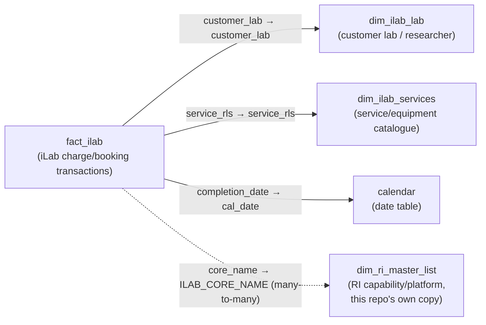

# iLab Utilisation Data Model

The tables, relationships and source queries behind [[iLab Utilisation]]. Eight tables, four relationships, one fact.

The data dictionary below is transferred in full and is meant to be read as reference. The narrative sections above it explain the shape those tables sit in.

> [!note] Reconciled against [[ri_pbi_ilab_utilisation semantic model]] — last on 2026-09-15
> First reconciled 2026-09-10: all 8 tables, 4 relationships, 29 measures and the 8 calculation items matched the export. Three things differed from the 2026-09-01 read and were corrected below: `dim_ilab_services` loads from the `ilab_3y.dim_ilab_services` table, not the `vw_dim_ilab_services` view; it carries a `category` column; and this repo's master-list copy carries 24 columns, not 19. Re-checked 2026-09-14 against `ri_pbi_ilab_utilisation` @ `1f015320`: four of the dead queries listed in [[iLab Utilisation Gotchas]] were deleted from `expressions.tmdl` — `base_facility`, `base_labs`, `base_external_institutes_adb`, and `source_external_organisation`. Their upstream `source_facility_adb`, `source_labs` and `source_external_institutes_adb` queries remain, now more orphaned than before (the `base_*` step that used to sit between them and nothing is simply gone). None of the four removed queries fed a live table, so no table, relationship, measure or column count changes then. Re-checked again 2026-09-15 against `1f015320` → `176d4b8f`: **the model-side table was renamed from `dim_facility_master_list` to `dim_ri_master_list`**, matching the name used in the other six repos (this note has been updated throughout to the new name). Content, columns and the relationship are otherwise unchanged. Go to the export for column types, measure DAX and the Power Query expression inventory. Hidden flags, `toCardinality` and descriptions are not in it, so the hidden state of the five SCD2 columns is still unverified.
>
> Re-checked 2026-09-19 against the 2026-09-19 export (`ri_pbi_ilab_utilisation` @ `f8c4a836`). The sub-repo commit moved, but the export was rendered from the same source graph (`944e789f`) as the `11a98af` export this note was last reconciled against, and every file under `graphify/ri_pbi_production/` apart from `_meta.md` is byte-identical. So nothing the export shows has changed. It also means the export cannot show what that commit did change. Re-reading the body: *Its own master list* counted the other repos loading the same table as six and the 24-column copies as three. Both predate [[Non-iLab Utilisation]] and are corrected.

> [!warning] `fact_ilab` refreshes nightly from month-old data
> `ilab_3y.ilab_award_income_researcher` — the source of `fact_ilab` (step 1 below) — is rebuilt nightly, but from a base table `ilab_3y.ilab_charges_award` last written **2026-08-04**, by hand from the `ri_ilab` repo. The nightly job faithfully re-derives stale input, so a successful refresh is not evidence the numbers are current. Verified live against Databricks on 2026-09-06; see [[Projects/Databricks/Reference/Databricks Migration State|Databricks Migration State]] for the full table-by-table freshness picture and the pipeline gaps behind it.

## The single fact

`fact_ilab` holds **one row per iLab charge or transaction** — an equipment usage line or a service request. Everything else in the model hangs off it:

| Table | Role |
|---|---|
| `fact_ilab` | The fact: charges/bookings |
| `dim_ilab_lab` | Customer lab / researcher |
| `dim_ilab_services` | Service and equipment catalogue |
| `dim_ri_master_list` | RI capability/platform — this repo's own copy of the shared master list |
| `calendar` | Date table, marked for time intelligence |
| `Key Measures` | Measure container, no data |
| `Time Intelligence` | Calculation group |
| `Parameter` | Disconnected field-parameter table |

The last three don't fit the fact/dimension/date split at all. `Parameter` implements a Power BI field parameter toggling a visual between `Labs (D)` and `Researchers (D)`; it has no relationships.

## Relationships

Four, which is the whole model.

Three are standard single-direction many-to-one. The fourth, to `dim_ri_master_list`, is flagged `toCardinality: many` — one `core_name` can map to several `ILAB_CORE_NAME` rows and back — the same pattern the master-list table takes in every other repo. None is inactive; none overrides `crossFilteringBehavior`.

**Two of these four carry the security model.** `dim_ilab_services` and `dim_ri_master_list` are both securable, which is why a platform role here needs two filters where every other repo needs one — see [[iLab Utilisation RLS]]. The `dim_ri_master_list` relationship in particular is what lets a governance-tier role filter a single column and still restrict `fact_ilab`.

### Its own master list

This repo's copy is loaded from the `ri_master_list` expression, which is `get_table_from_mace("ri_master_list", "ri_lakehouse")` — the **same physical Databricks table**, through the same source expression, that the other seven repos load. As of the 2026-09-15 export the model-side table name is `dim_ri_master_list` here too — renamed from `dim_facility_master_list`, which was the last naming divergence between this copy and the rest of the suite (the join key, `ILAB_CORE_NAME`, is still repo-specific, as it is everywhere the master list is joined). This copy carries 24 columns, same as [[Asset]], [[Awards]] and [[Publication]] as of 2026-09-15 and [[Non-iLab Utilisation]] since 2026-09-18; [[Risk]] carries the 19-column non-SCD2 shape, and [[Finance]] narrows its own to nine. The extra five here are underscore-prefixed SCD columns (`_BUSINESS_KEY`, `_START_TIMESTAMP`, `_EXPIRATION_TIMESTAMP`, `_ROW_ACTIVE_FLAG`, `_SURROGATE_KEY`) — this was the *first* repo to carry them, before the 2026-09-15 widening brought the others up to the same shape.

So the naming divergence [[Shared Conventions]] used to warn about is resolved. Anything true of [[dim_ri_master_list Reference|dim_ri_master_list]] — its column groups, its capability/node grain, the fact that its `RLS_*` columns go unused — is true of this table too.

## Source flow

All source queries live in `expressions.tmdl`, reading Databricks catalog `pen_research_infrastructure_insights_prd`, schema `ilab_3y`, plus `ri_lakehouse` for the master list.

**Connection and helpers.** `Databricks_MACE` holds the connection record (`adb_https`, `adb_sql = "/sql/1.0/warehouses/5cc645cded66580f"`, `adb_catalog`, `database = "ilab_3y"`). Every live source query calls the two-argument `get_table_from_mace(_a_table_name, _schema_name)`. A single-argument earlier version — reading the schema from `Databricks_MACE[database]` rather than a parameter — is left commented out inside the same expression. Dead, but it is the first definition you meet when reading the file.

**Parameters.** `StartDate` (2000-01-01) and `EndDate` (2026-12-31) bound `calendar`'s `List.Dates` range. Two further parameters, `data_path` and `file_type`, are disconnected leftovers from a pre-Databricks manual-CSV workflow and feed nothing — see [[iLab Utilisation Gotchas]].

**Core data flow.** Fourteen queries, of which four reach live tables:

1. `ilab_award_income_researcher` = `get_table_from_mace("ilab_award_income_researcher", "ilab_3y")` — the raw charge/award extract.
2. `base_ilab_award_income_researcher` — retypes date columns; adds `asset_tat` as `Duration.Days([completion_date] − [purchase_date])`; selects the final column set; duplicates `payment_information` and splits it on `"-"` into `payment_information_fund_centre` / `payment_information_fund`, replacing parse errors with `-2`.
3. **`fact_ilab`** sources directly from that.
4. `source_services_adb` = `get_table_from_mace("dim_ilab_services", "ilab_3y")` — the `dim_ilab_services` table; the 2026-09-01 read recorded the `vw_dim_ilab_services` view here. It selects the service columns listed under [[ri_pbi_ilab_utilisation semantic model#dim_ilab_services]], which now include `category`.
5. `base_services_adb` — adds a table key on `serviceorequipmentid` and duplicates it into a text-typed `serviceorequipmentid search` column.
6. **`dim_ilab_services`** sources from that.
7. `source_ilab_lab_adb` = `get_table_from_mace("vw_dim_ilab_customer_lab", "ilab_3y")` — the raw customer/lab reference.
8. `source_mhp_customer_groups` — a hardcoded lab→category table literal; see below.
9. `base_mhp_customer_groups` — a passthrough of it.
10. `base_ilab_lab` — for rows missing `customer_faculty`, splits `customer_department` on `" - "` to backfill faculty and department, re-inserting those rows alongside the ones that already had a faculty; merges `base_mhp_customer_groups` on `customer_lab` = `lab` to add `mhp_category`, defaulting unmatched rows to `"NEVER_USED_MHP-MHTP"`; de-duplicates.
11. **`dim_ilab_lab`** sources from that.
12. `ri_master_list` = `get_table_from_mace("ri_master_list", "ri_lakehouse")`.
13. **`dim_ri_master_list`** sources directly from that.
14. **`calendar`** builds its range from `StartDate`/`EndDate` via `List.Dates`, then derives year/month/quarter/week attributes and an Australian financial-year label (`fiscal_year`, `fy_label`).

`dim_ilab_lab` is the only dimension with real transformation logic behind it. Everything else is a near-passthrough.

### The pinned MHP reference snapshot

`source_mhp_customer_groups` is a hardcoded M table literal — `#table(...)`, written out in full rather than base64-compressed as in [[Asset]] — of roughly 140 named PI labs mapped to an MHP campus grouping: `HUDSON`, `SCS` or `OTHER`. It feeds `dim_ilab_lab[mhp_category]` through the step 10 merge.

Treat it as a pinned snapshot. **Any new lab that should be grouped under Hudson or SCS needs a manual edit here** — nothing upstream will supply it, and an unmatched lab silently becomes `"NEVER_USED_MHP-MHTP"` rather than raising an error.

### Dead chains

Several M chains are defined but consumed by no live table — no matching `ref table` in `model.tmdl`. None carries a `queryGroup: decomissioned` label, so they read as live until traced. Listed in [[iLab Utilisation Gotchas]].

## Data dictionary

Every table and column in the model, transferred in full.

**Hidden** means not shown in the Fields pane — still queryable by measures and relationships. Sort-helper columns exist only to control the display order of their paired label column via `sortByColumn`.

### fact_ilab

Fact table: one row per iLab charge/transaction (an equipment booking or service request line). Source for all volume, revenue, and turnaround-time measures in `Key Measures`. Not hidden.

| Column | Data type | Hidden | Description |
|---|---|---|---|
| `pi_email` | string | **No** | Email address of the Principal Investigator associated with the charge. |
| `service_id` | string | **No** | iLab internal service ID for the charge/request line. |
| `service_type` | string | **No** | Type of service/request recorded in iLab for this charge. |
| `asset_id` | int64 | **No** | iLab equipment/service asset identifier for the charge; compared against `dim_ilab_services[serviceorequipmentid]` (not `dim_ilab_services[asset_id]`) in the `filter_assest` measure. |
| `customer_lab` | string | **No** | Name of the requesting researcher's lab; join key to `dim_ilab_lab[customer_lab]`. |
| `customer_department` | string | **No** | Customer's department, as recorded in iLab. |
| `customer_institute` | string | **No** | Customer's institute/organisation name; summed via `DISTINCTCOUNT` in `External Organisations (D)`. |
| `payment_information` | string | **No** | Raw payment/cost-centre-fund string as entered in iLab (e.g. `"CostCentre-Fund"`); split into `payment_information_fund_centre`/`payment_information_fund` upstream in M. |
| `revenue_cost_centre_fund` | string | **No** | Revenue-side cost centre/fund reference for the charge. |
| `status` | string | **No** | Charge/request status (e.g. complete, cancelled) from iLab. |
| `billing_status` | string | **No** | Billing status of the charge (e.g. billed, unbilled). |
| `quantity` | double | **No** | Quantity of service/equipment usage charged (hours or units); summed in `Equipment Hours` and `Quantity (N)`. |
| `total_price` | double | **No** | Dollar value of the charge; summed in `Charges ($)`. |
| `price_type` | string | **No** | Pricing tier applied to the charge (e.g. internal/external rate). |
| `creation_date` | dateTime | **No** | Date the charge/request was created in iLab. |
| `purchase_date` | dateTime | **No** | Date the request was purchased/approved; used with `completion_date` to derive `asset_tat`/`service_duration`. |
| `completion_date` | dateTime | **No** | Date the service/equipment usage was completed; the fact table's join key to `calendar[cal_date]` and basis for `completion_year`. |
| `billing_date` | dateTime | **No** | Date the charge was billed. |
| `core_name` | string | **No** | Name of the iLab core facility/platform that delivered the service; join key (many-to-many) to `dim_ri_master_list[ILAB_CORE_NAME]`; also referenced directly by the `CENTRAL-ADMIN`/`MNHS-ADMIN` RLS row filters. |
| `center` | string | **No** | iLab "Center" institutional grouping the core facility belongs to. |
| `invoice_num` | string | **No** | Invoice number associated with the billed charge. |
| `charge_id` | int64 | **No** | Unique iLab charge ID; the fact table's transaction grain, used in most `SUMX`/`COUNTROWS` measure logic to avoid double counting. |
| `reviewed` | string | **No** | Whether the charge has been reviewed in iLab. |
| `category` | string | **No** | Charge category/classification (e.g. `"MAE"`, used by the `ENG-DMAE` RLS role filter). |
| `usage_type` | string | **No** | Type of usage recorded for the charge. |
| `completion_year` | int64 | **No** | Calendar year of `completion_date`, pre-derived for year-based filtering (e.g. used by the `Services (G)` growth measure). |
| `charge_name` | string | **No** | Free-text name/description of the charge line. |
| `job_name` | string | **No** | Name of the job/request the charge belongs to. |
| `service_duration` | int64 (calculated) | **No** | DAX calculated column: `DATEDIFF(fact_ilab[purchase_date], fact_ilab[completion_date], DAY)` — turnaround time in days; a DAX-layer companion/duplicate of the M-derived `asset_tat`. |
| `asset_tat` | int64 | **No** | Turnaround time in days between `purchase_date` and `completion_date`, pre-computed in M (`Duration.Days`); feeds `Service (Avg. TAT)`. |
| `customer_name` | string | **No** | Name of the requesting customer/researcher. |
| `award_id` | int64 | **No** | Research award/grant ID the charge is billed against. |
| `sap_ack_id` | int64 | **No** | SAP acknowledgement/reference ID for the charge. |
| `payment_information_fund_centre` | string | **No** | Cost-centre portion of `payment_information`, split on `"-"`. |
| `payment_information_fund` | int64 | **No** | Fund portion of `payment_information`, split on `"-"` and parsed to a number (`-2` on parse error). |
| `researcher_id` | int64 | **No** | iLab internal researcher identifier. |
| `user_login_email` | string | **No** | Email/login of the user who submitted the request; drives `Researchers (D)` and related distinct-researcher measures. |
| `service_rls` | string | **No** | Join key to `dim_ilab_services[service_rls]` — the relationship that ultimately exposes `dim_ilab_services[facility_id]`/`[type]` for filtering and RLS. |
| `fund_fund_centre_id` | string | **No** | Combined fund/fund-centre identifier for the charge's funding source. |

Notably, **no column in `fact_ilab` is hidden** — every field is exposed in the Fields pane, unlike the heavier-hidden fact tables seen elsewhere in the RI suite.

### dim_ri_master_list

This repo's own copy of the cross-system RI capability/platform reference table (sourced from the same `ri_master_list` Databricks table used elsewhere in the suite). Renamed from `dim_facility_master_list` to `dim_ri_master_list` on 2026-09-15, matching the model-side name used in the other six repos. The relationship join key here is `ILAB_CORE_NAME` (`fact_ilab[core_name]` → `dim_ri_master_list[ILAB_CORE_NAME]`, many-to-many). Table not hidden.

| Column | Data type | Hidden | Description |
|---|---|---|---|
| `INDEX` | int64 | **No** | Row sequence number from the source table; not used for reporting or joins. |
| `CAPABILITY_CODE` | string | **No** | Unique code identifying a capability (facility/platform); the tablePermission filter value for most facility-level RLS roles (e.g. `BCIF`, `MARP`) — not the relationship join key in this repo. |
| `CAPABILITY_NAME` | string | **No** | Display name of the capability. |
| `NODE_ID` | string | **No** | Org node identifier; used by several RLS roles on `dim_ri_master_list` instead of `CAPABILITY_CODE` — sometimes as the second platform filter (e.g. `BDI-*`, `FLOW-*`, `HELIX`, `MMI-*`, `MMIC-HMST`, `MMIC`, `STM-GEN`, `ENG-DCE`/`ENG-DCHME`/`ENG-DECSE`/`ENG-FETS`) and sometimes as the only dim-facility filter in exception roles such as `MGBP-BI`, `ENG-DMSE`, and `ENG-DMAE`. |
| `NODE_NAME` | string | **No** | Display name of the organisational node. |
| `COST_CENTRE_NAME` | string | **No** | Name of the cost centre associated with the capability. |
| `COST_CENTRE` | string | **No** | SAP cost centre code; the join key used for this table in `ri_pbi_asset` — not used for any relationship or RLS filter in this repo. |
| `FUND_ID` | string | **No** | Fund identifier, used for finance-report joins in `ri_pbi_finance`. |
| `CAPABILITY_ISO` | string | **No** | ISO accreditation status/code for the capability. |
| `CAPABILITY_TYPE` | string | **No** | Classification of the capability (e.g. platform, facility, service). |
| `CAPABILITY_GOVERNANCE` | string | **No** | Governance model/committee the capability reports into; the tablePermission filter value for the org-level admin roles (`BUSECO-ADMIN`, `ENG-ADMIN`, `MIPS-ADMIN`, `MNHS-ADMIN`, `SCI-ADMIN`, `CENTRAL-ADMIN`). |
| `SURVEY_CAPABILITY_ID` | string | **No** | Join key to `ri_pbi_survey` results. |
| `PURE_ORGANISATION_ID` | string | **No** | Join key to PURE research-organisation records. |
| `PURE_FACILITY_NAME` | string | **No** | Facility name in PURE, used for `ri_pbi_publication` joins. |
| `PURE_FACILITY_ID` | int64 | **No** | Numeric facility ID, join key to PURE publication records. |
| `ILAB_CAPABILITY_ID` | string | **No** | Alternate iLab capability identifier; not the relationship join key used in this model. |
| `ILAB_CORE_NAME` | string | **No** | Core facility name in iLab — **the join key this repo uses** for the `fact_ilab` → `dim_ri_master_list` relationship (many-to-many, since one core can span multiple capability codes and vice versa). |
| `RLS_FACILITY_GROUP` | string | **No** | RLS group for facility-level access restriction. Not referenced by any `tablePermission` filter found in `roles/*.tmdl` — roles here filter on `CAPABILITY_CODE`/`NODE_ID`/`CAPABILITY_GOVERNANCE` instead. Purpose unclear — review with model owner. |
| `RLS_FACULTY_GROUP` | string | **No** | RLS group for faculty-level access restriction. Same caveat as `RLS_FACILITY_GROUP` — not referenced by any role filter observed. Purpose unclear — review with model owner. |
| `_BUSINESS_KEY` | string | *unverified* | Source-system business key underpinning the SCD2 versioning; not used by any relationship here. This and the four rows below are in the export as of 2026-09-10 but were not in the 2026-09-01 read. |
| `_START_TIMESTAMP` | dateTime | *unverified* | Source-system SCD2 validity start timestamp. |
| `_EXPIRATION_TIMESTAMP` | dateTime | *unverified* | Source-system SCD2 validity expiration timestamp. |
| `_ROW_ACTIVE_FLAG` | string | *unverified* | Flag indicating whether this row is the currently active version. |
| `_SURROGATE_KEY` | int64 | *unverified* | Source-generated surrogate key for this row. |

Unlike `ri_pbi_asset`'s equivalent table (which exposes only 5 of its 19 columns — see [[Asset Data Model]]), **every column of this table in the 2026-09-01 read is exposed** in this repo — none of those 19 is hidden. Whether the five SCD columns above are hidden is unverified.

### dim_ilab_lab

Each unique customer lab (research group) that has booked iLab services/equipment, with institute, faculty, and institution-type classifications. Table not hidden.

| Column | Data type | Hidden | Description |
|---|---|---|---|
| `customer_lab` | string | **No** *(isKey)* | Unique lab name; join key to `fact_ilab[customer_lab]`. |
| `customer_department` | string | **No** | Department the lab belongs to. |
| `customer_institute` | string | **No** | Institute/organisation the lab belongs to. |
| `customer_institute_group` | string (calculated) | **No** | Power BI "group" column (SWITCH-based) collapsing `customer_institute` into `"HUDSON INSTITUTE OF MEDICAL RESEARCH"`, `"MONASH UNIVERSITY"` (incl. Malaysia campus), `"OTHER EXT"`, or `"(Blank)"`. |
| `customer_faculty` | string | **No** | Faculty of the lab (for Monash-affiliated labs); backfilled for some rows in `base_ilab_lab` by splitting `customer_department`. |
| `mhp_category` | string | **No** | MHP customer-group classification (`HUDSON`/`SCS`/`OTHER`/`"NEVER_USED_MHP-MHTP"`), looked up from the hardcoded `source_mhp_customer_groups` reference table by lab name. |
| `abn` | int64 | **No** | Australian Business Number of the customer's institute (for external/industry customers). |
| `country` | string | **No** | Country of the customer institute. |
| `institution_type` | string | **No** | Raw institution type from source (e.g. `GOVERNMENT`, `INDUSTRY`, `MONASH UNIVERSITY`, `MEDICAL RESEARCH INSTITUTE`, `PUBLICLY FUNDED ORGANISATION`, `UNIVERSITIES`). |
| `iso3_code` | string | **No** | ISO 3-letter country code. |
| `postcode` | int64 | **No** | Postcode of the customer institute. |
| `sap_client_number` | int64 | **No** | SAP client/customer number for billing. |
| `state` | string | **No** | State/territory of the customer institute. |
| `institution_type_lvl_2` | string (calculated) | **No** | Power BI "group" column simplifying `institution_type` into `GOVERNMENT`/`INDUSTRY`/`MONASH UNIVERSITY`/`RESEARCH INSTITUTES`/`UNIVERSITIES`/`Other`. |
| `institution_type_lvl_1` | string (calculated) | **No** | Power BI "group" column collapsing `institution_type` into `EXTERNAL` vs `INTERNAL` (Monash); used by `Monash Researchers (D)` and `External Organisations (D)`. |
| `institution_type_LVL_3` | string (calculated) | **No** | Power BI "group" column collapsing `institution_type` into `EXTERNAL RESEARCH INSTITUTES` / `INDUSTRY/GOVERNMENT` / `MONASH UNIVERSITY`; used by `Ind/Govt Researchers (D)`, `Ext Res/Acad Researchers (D)`, `Ind/Govt Institute (D)`. |

`dim_ilab_lab` also carries one measure of its own, `Industry Partners (D)` — see [[iLab Utilisation Measures]].

### dim_ilab_services

Each unique iLab service or equipment item offered by a facility, with its type and category. Table not hidden.

| Column | Data type | Hidden | Description |
|---|---|---|---|
| `service_rls` | string | **No** | Relationship join key to `fact_ilab[service_rls]`. |
| `asset_id` | int64 | **No** | iLab numeric asset/service ID carried on this dimension row. Purpose unclear beyond that — the `filter_assest` measure compares `fact_ilab[asset_id]` against `dim_ilab_services[serviceorequipmentid]`, not this column, so its exact relationship to `fact_ilab[asset_id]` isn't obvious from the model alone; review with model owner. |
| `file_name` | string | **No** | Source file name the row was loaded from — lineage/debugging metadata from the underlying Databricks view. |
| `serviceorequipmentid` | int64 | **No** | iLab service-or-equipment ID; the value facility-scoped visibility logic (`filter_assest` measure) compares against `fact_ilab[asset_id]`. |
| `serviceorequipmentname` | string | **No** | Display name of the service or equipment. |
| `type` | string | **No** | Whether the row represents `"EQUIPMENT"` or `"SERVICE"` — drives the `Equipment (D)`/`(N)`/`Hours` and `Services (D)`/`(N)`/`(G)` measure filters. |
| `servicecategory` | string | **No** | Category/classification of the service or equipment. |
| `facility_id` | string | **No** | The RI platform/facility code that owns this service/equipment; the `tablePermission` filter column used by nearly every per-platform RLS role. |
| `serviceorequipmentid search` | string | **No** | Text-typed duplicate of `serviceorequipmentid`, added purely to support text search/matching in visuals (the source column is numeric and can't be full-text searched directly). |
| `category` | string | *unverified* | Purpose unclear — review with model owner. Distinct from `servicecategory`. In the export as of 2026-09-10 but not in the 2026-09-01 read; first seen alongside the switch to the `dim_ilab_services` source table. |

### calendar

Standard date table, one row per calendar day across the `StartDate`–`EndDate` range (2000-01-01 to 2026-12-31). Marked as the model's date table for time intelligence. Table not hidden.

| Column | Data type | Hidden | Description |
|---|---|---|---|
| `cal_date` | dateTime | **No** *(date-table key)* | The calendar date for this row; join key to `fact_ilab[completion_date]`. |
| `cal_intdate` | int64 | **No** | `cal_date` as a whole number (date serial); alternative numeric key. |
| `cal_year` | int64 | **No** | Calendar year of `cal_date`; drives the `selected period` measure and the `cal_year Hierarchy`. |
| `cal_month` | int64 | **No** *(sort-helper)* | Month number (1–12); sorts `cal_month_name` chronologically instead of alphabetically. |
| `cal_month_name` | string | **No** | Full month name (e.g. "January"), sorted by `cal_month`. |
| `MonthYear` | string | **No** | Short month-and-year label (e.g. "Jan-2024") for chart axes, sorted by `cal_mon_year_int`. |
| `cal_mon_year_int` | int64 | **No** *(sort-helper)* | Combined YYYYMM number, sorts `MonthYear` chronologically. |
| `Start of Month` | dateTime | **No** | First day of the month containing `cal_date`. |
| `Start of Quarter` | dateTime | **No** | First day of the quarter containing `cal_date`. |
| `Quarter` | string | **No** | Calendar quarter label (e.g. "Q1"), sorted by `Quarter_num`. |
| `Quarter_num` | int64 | **No** *(sort-helper)* | Calendar quarter number (1–4); sorts `Quarter` chronologically. |
| `Week of Year` | int64 | **No** | ISO week number of the year. |
| `fiscal_year` | int64 | **No** | Australian financial year (July–June). |
| `fy_label` | string | **No** | Financial year label, "FY YY/YY" format. |

Unlike `ri_pbi_asset`'s `calendar` (which hides everything except `cal_year`), **every column here is exposed**, including the three sort-helper columns (`cal_month`, `cal_mon_year_int`, `Quarter_num`) that the usual convention would hide — see [[iLab Utilisation Gotchas]].

### Parameter

A disconnected, calculated "field parameter" table (not part of the star schema) letting users toggle a visual between two `Key Measures` measures via a slicer. Table not hidden.

| Column | Data type | Hidden | Description |
|---|---|---|---|
| `Parameter` | string | **No** | Display label of the metric currently offered/selected (`"Labs (D)"` or `"Researchers (D)"`); sourced from the calculated table's `Value1`, sorted by `Parameter Order`, grouped via `Parameter Fields`. |
| `Parameter Fields` | string | Yes | Power BI's internal `NAMEOF()` binding column — the actual measure reference (`NAMEOF('Key Measures'[Labs (D)])` / `NAMEOF('Key Measures'[Researchers (D)])`) each `Parameter` row swaps into the bound visual. Hidden by design (Field Parameter plumbing). |
| `Parameter Order` | int64 | Yes *(sort-helper)* | Numeric sort order (0, 1) controlling the display sequence of `Parameter`. |

### Time Intelligence

A calculation-group table providing manual date-comparison calculation items (used since model-level automatic time intelligence is disabled). Table not hidden.

| Column | Data type | Hidden | Description |
|---|---|---|---|
| `Formula` | string | **No** | The calculation-item label shown in a slicer/legend (`Total`, `CY`, `PY`, `YoY (%)`, `CML.`, `YTD`, `PY YTD`, `YTD(%)`), sorted by `Ordinal`. |
| `Ordinal` | int64 | Yes *(sort-helper)* | Controls the display order of `Formula` in slicers/visuals; standard calculation-group ordinal column. |

Its calculation items are documented in [[iLab Utilisation Measures]].

### Key Measures

Container table for all report-wide DAX measures (28 of the model's 29 measures live here). Holds no data of its own; no columns.

## See also

- [[iLab Utilisation]] — the repo entry note
- [[iLab Utilisation Measures]] — the measure inventory built on these tables
- [[iLab Utilisation RLS]] — the two securable tables and the three role tiers
- [[iLab Utilisation Gotchas]] — dead code and naming defects
- [[dim_ri_master_list Reference|dim_ri_master_list]] — the shared identity table, joined here on `ILAB_CORE_NAME`; this repo's model-side table was renamed to match on 2026-09-15
- [[Shared Conventions]] — the PBIP layout and Databricks source pattern
- [[ri_pbi_ilab_utilisation semantic model]] — the exported model (derived, never hand-edited): every column and type, measure DAX, relationships and Power Query expressions
- [[Projects/Databricks/Reference/Databricks Migration State|Databricks Migration State]] — upstream in [[Projects/RI iLab/Overview|RI iLab]]: what actually writes `ilab_award_income_researcher`, how fresh it is, and the pipeline gaps behind the warning above
- **Derived layer** (`graphify/`, never hand-edited): [[_COMMUNITY_iLab Data Pipeline]], [[_COMMUNITY_iLab Booking Records]], [[_COMMUNITY_GRC Equipment Preprocessing]], [[dim_facility_master_list]], [[dim_ilab_services]], [[dim_ilab_lab]], [[ilab_award_income_researcher_1]], [[base_ilab_award_income_researcher]], [[base_ilab_lab]], [[base_services_adb]], [[base_mhp_customer_groups]], [[source_services_adb]], [[source_ilab_lab_adb]], [[pen_research_infrastructure_insights_prd.ilab_3y.dim_ilab_facility]], [[pen_research_infrastructure_insights_prd.ilab_3y.vw_dim_ilab_customer_lab]], [[Databricks_MACE_4]], [[get_table_from_mace_4]]
- **Derived layer — more M queries** (`graphify/`, never hand-edited): [[source_mhp_customer_groups]], [[file_type]], [[ri_master_list_1]], [[data_path_3]], [[StartDate_2]], [[EndDate_2]]
